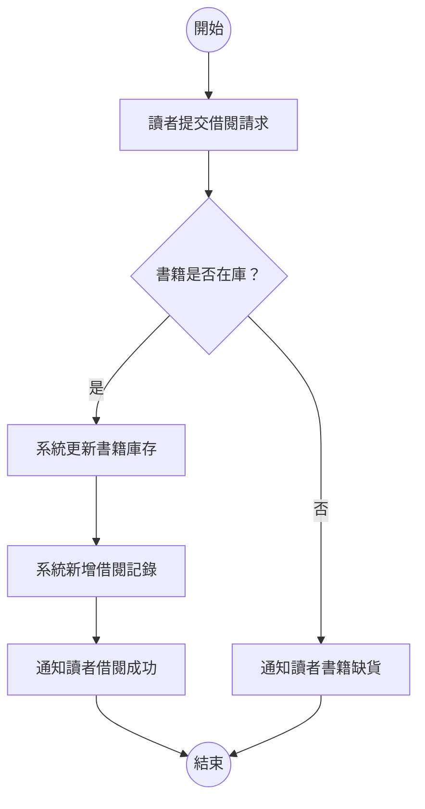
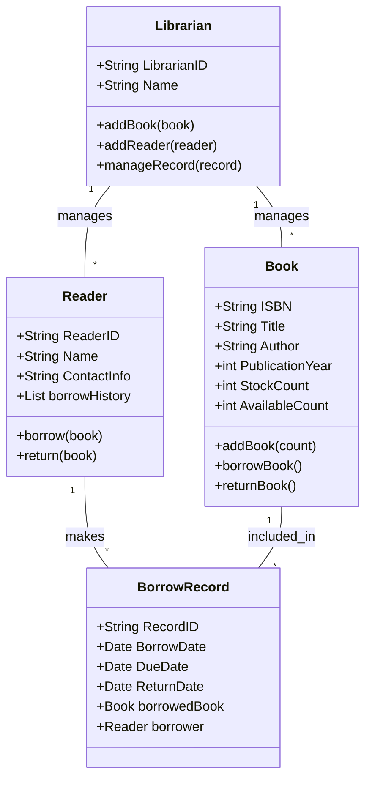

# 2-1 需求工程與系統模型

本章將深入探討系統開發生命週期中的關鍵階段——需求工程，以及在理解、分析和溝通系統時不可或缺的工具——系統模型。透過本章的學習，您將能夠掌握如何有效地定義、分析和呈現系統需求，為後續的系統設計與開發奠定堅實基礎。

-----

### 1. 核心概念與定義

#### 1.1 需求工程 (Requirements Engineering, RE)

**定義/核心觀念：**
需求工程是軟體或系統開發生命週期中的一個關鍵階段，旨在探索、發現、分析、文件化、驗證和管理系統或軟體的所有需求。其核心目標是確保最終開發出的系統能夠精確地滿足利害關係人（Stakeholders）的期望和業務目標。它是一個迭代的過程，而非單一的一次性活動。

**例子或推導：**
想像建造一棟房子。在動工之前，建築師必須與屋主、承包商、市政府等利害關係人進行大量溝通，了解屋主的需求（例如：幾間臥室、開放式廚房、是否有庭院、預算限制、完工時間等）。這個了解、記錄、確認和管理所有期望的過程，就類似於軟體開發中的需求工程。如果這個階段做得不好，建好的房子可能不符合屋主的期望，甚至無法居住。

**與相鄰概念的關聯：**
需求工程是系統開發的起點，直接影響後續的系統分析、設計、實作、測試和部署階段。清晰、完整且一致的需求是成功專案的基石。

-----

#### 1.2 需求 (Requirements)

**定義/核心觀念：**
需求是系統必須具備的能力、條件或特性，以解決問題、滿足使用者需要或達成特定業務目標。需求通常分為兩大類：

*   **功能性需求 (Functional Requirements, FR)**：描述系統應該「做什麼」或「提供什麼服務」。它們定義了系統的行為。
    *   **例子：**
        *   使用者可以登入系統。
        *   系統可以搜尋圖書館的書籍。
        *   系統允許使用者新增、修改和刪除員工資料。
*   **非功能性需求 (Non-Functional Requirements, NFR)**：描述系統「如何做」或系統的品質屬性。它們定義了系統的效能、可靠性、安全性、可用性、可維護性等特性。
    *   **例子：**
        *   系統必須在 3 秒內響應使用者請求。（效能）
        *   系統應支援至少 1000 個併發使用者。（可擴展性）
        *   系統需採用 SSL/TLS 加密保護使用者資料。（安全性）
        *   系統每週應提供 99.9% 的可用性。（可靠性）

**例子或推導：**
開發一個線上購物網站。
*   **功能性需求** 可能包括：使用者可以註冊帳號、瀏覽商品、將商品加入購物車、結帳、查看訂單歷史。
*   **非功能性需求** 可能包括：網站在尖峰時段能處理 1000 筆訂單/分鐘、網站應在任何主流瀏覽器上正常顯示、使用者付款資訊需加密儲存、系統故障時應能迅速恢復。

**與相鄰概念的關聯：**
需求是系統模型化（例如，用例圖、活動圖）的直接輸入。功能性需求通常與用例和系統行為模型緊密相關，而非功能性需求則影響系統架構設計和測試策略。

-----

#### 1.3 系統模型 (System Models)

**定義/核心觀念：**
系統模型是對真實世界系統的抽象表示，通常以圖形或符號的形式呈現。它們的目的是幫助利害關係人（包括開發者、使用者和業務分析師）理解、溝通、分析和設計複雜的系統。模型可以從不同的視角描繪系統，例如其結構、行為、資料流或互動。

**目的：**
1.  **可視化複雜性：** 將抽象的概念具象化，降低理解難度。
2.  **促進溝通：** 提供一個共通的語言和視角，減少誤解。
3.  **分析與驗證：** 幫助發現潛在問題、不一致或未滿足的需求。
4.  **設計基礎：** 為系統的實作提供藍圖。

**種類：**
*   **結構模型 (Structural Models)**：描述系統的靜態結構，如組成元件、元件間的關係。
    *   **例子：** 類別圖 (Class Diagram)、實體關係圖 (Entity-Relationship Diagram, ERD)、部署圖 (Deployment Diagram)。
*   **行為模型 (Behavioral Models)**：描述系統的動態行為，如事件順序、物件狀態變化、資料流。
    *   **例子：** 用例圖 (Use Case Diagram)、活動圖 (Activity Diagram)、循序圖 (Sequence Diagram)、狀態機圖 (State Machine Diagram)。

**例子或推導：**
想像設計一個交通燈控制系統。
*   **結構模型** 可能是一個類別圖，顯示 `TrafficLight` 類別、`Sensor` 類別和 `Controller` 類別，以及它們之間的關聯。
*   **行為模型** 可能是一個狀態機圖，顯示交通燈從「紅燈」到「黃燈」再到「綠燈」的轉換條件和動作。也可能是一個活動圖，描述偵測到車輛後觸發變燈的流程。

**與相鄰概念的關聯：**
系統模型是將文字需求轉化為可視化設計的重要橋樑。它們是需求分析的產物，也是系統設計的輸入。UML (Unified Modeling Language) 是最常用的系統模型化標準之一。

-----

### 2. 典型例子與轉換/推導

#### 2.1 從需求到系統模型：以線上圖書館管理系統為例

我們將以一個簡化的「線上圖書館管理系統」為例，展示如何從需求描述轉換為常見的系統模型。

**系統簡要描述：**
一個線上圖書館管理系統，允許圖書館管理員管理書籍、讀者和借閱記錄。讀者可以在線上搜尋書籍、借閱書籍、歸還書籍以及查看自己的借閱歷史。

**核心需求（部分）：**
1.  **FR-001：** 讀者可以搜尋圖書館內的書籍。
2.  **FR-002：** 讀者可以借閱書籍。
3.  **FR-003：** 讀者可以歸還書籍。
4.  **FR-004：** 讀者可以查看其借閱歷史。
5.  **FR-005：** 管理員可以新增書籍到館藏。
6.  **FR-006：** 管理員可以新增讀者資料。
7.  **NFR-001：** 系統應在 2 秒內完成書籍搜尋。
8.  **NFR-002：** 系統必須確保借閱資料的正確性。

-----

#### 2.2 模型化範例

##### 2.2.1 用例圖 (Use Case Diagram)

**目的：** 表現系統的功能性需求，以及不同類型的使用者（或外部系統）如何與這些功能互動。

**推導：**
從功能性需求 (FR-001 ~ FR-006) 中識別出主要的參與者（Actor）和用例（Use Case）。

*   **參與者：** 讀者、管理員。
*   **用例：** 搜尋書籍、借閱書籍、歸還書籍、查看借閱歷史、新增書籍、新增讀者。

```mermaid
graph TD
    A[讀者] --> (搜尋書籍)
    A --> (借閱書籍)
    A --> (歸還書籍)
    A --> (查看借閱歷史)
    B[管理員] --> (新增書籍)
    B --> (新增讀者)
    B --> (管理借閱記錄)
```
**圖 2.2.1 線上圖書館管理系統用例圖（簡化）**

##### 2.2.2 活動圖 (Activity Diagram)

**目的：** 表現業務流程、系統行為的動態流程，顯示一系列活動的順序、條件和併發性。

**推導：**
以「讀者借閱書籍」這個用例為例，將其內部流程步驟化。

*   **流程：** 讀者提交借閱請求 -> 系統檢查書籍庫存 -> 系統更新庫存 -> 系統新增借閱記錄 -> 通知讀者。


**圖 2.2.2 讀者借閱書籍活動圖（簡化）**

##### 2.2.3 類別圖 (Class Diagram)

**目的：** 表現系統的靜態結構，包括類別（物件的藍圖）、它們的屬性、方法以及類別之間的關係（關聯、聚合、組合、繼承）。

**推導：**
從系統描述中識別出關鍵的實體（概念），例如書籍、讀者、借閱。為每個實體定義其屬性和可能的行為（方法），並建立它們之間的關係。


**圖 2.2.3 線上圖書館管理系統類別圖（簡化）**

-----

### 3. 與相鄰概念的關聯

#### 3.1 需求工程與軟體開發生命週期 (SDLC)

**關聯：**
需求工程是 SDLC 的第一步，是所有後續階段的基礎。它為系統設計、實作、測試和部署提供了明確的目標和範圍。

*   **影響設計：** 需求工程產出的需求規格說明書和系統模型直接作為系統設計階段的輸入。
*   **影響實作：** 開發人員依據設計（基於需求）編寫程式碼。
*   **影響測試：** 測試人員基於需求來設計測試案例，驗證系統是否滿足所有功能性和非功能性需求。
*   **影響維護：** 良好的需求文件有助於未來系統的維護和功能擴展。

#### 3.2 需求工程與系統分析及設計

**關聯：**
需求工程與系統分析和設計是緊密相連的迭代過程。

*   **需求工程** 專注於「我們要做什麼？」（What to build?）。其產出（如需求文件、用例模型）是**系統分析**的基礎。
*   **系統分析** 進一步分解需求，理解業務流程，並開始建立高層次的系統模型，以確定「如何解決問題？」（How to solve the problem?）。
*   **系統設計** 則更深入地將分析結果轉化為具體的系統架構、元件設計和介面規範，定義「如何建造它？」（How to build it?）。

系統模型是這三個階段之間溝通和轉換的橋樑。

#### 3.3 需求工程與專案管理

**關聯：**
需求工程的結果對專案管理至關重要。

*   **範圍管理：** 需求定義了專案的範圍，幫助避免範圍蔓延（Scope Creep）。
*   **時間與成本估算：** 需求的複雜度和數量直接影響專案的時間和成本估算。
*   **風險管理：** 模糊不清或不完整的需求是專案失敗的主要風險之一。
*   **變更管理：** 需求變更是不可避免的，需求工程中的變更管理流程對於控制專案影響至關重要。

-----

### 4. 進階內容：需求追溯性與基於模型的系統工程

#### 4.1 需求追溯性 (Requirements Traceability)

**核心觀念：**
需求追溯性是指能夠追蹤和記錄需求從其來源（如業務目標、利害關係人需求）到其在系統開發生命週期中各個階段（如設計、實作、測試）的實現過程的能力。它建立了一種雙向連結，可以從需求追溯到其實現，也可以從實現追溯回其所滿足的需求。

**目的：**
*   **影響分析：** 當需求變更時，可以快速識別受影響的設計、程式碼和測試案例。
*   **覆蓋率驗證：** 確保所有需求都已被設計、實作和測試。
*   **品質保證：** 有助於驗證最終產品是否符合原始需求。
*   **合規性：** 對於受法規約束的行業尤其重要。

**例子：**
一個需求追溯性矩陣可能長這樣：

| 需求 ID | 設計元件 ID | 程式模組 ID | 測試案例 ID |
| :------ | :---------- | :---------- | :---------- |
| FR-001  | Design-01   | ModuleA.java | TC-001      |
| FR-002  | Design-02   | ModuleB.java | TC-002      |
| ...     | ...         | ...         | ...         |

-----

#### 4.2 基於模型的系統工程 (Model-Based Systems Engineering, MBSE)

**核心觀念：**
MBSE 是一種系統工程方法，它將正式的系統模型作為系統開發的核心手段，而不是傳統上依賴於文字文件。MBSE 使用統一的建模語言（如 SysML）來描述系統的各個方面，從概念到架構、設計和驗證。

**優點：**
*   **提高準確性：** 模型比文字描述更精確，減少模糊性和誤解。
*   **增強溝通：** 視覺化的模型更容易被不同利害關係人理解。
*   **早期錯誤發現：** 可以在開發早期通過模型分析和模擬發現問題。
*   **支援自動化：** 模型可以作為代碼生成、測試案例生成和系統驗證的輸入。
*   **改進追溯性：** 模型中的元素可以更容易地相互連結和追溯。

**與需求工程的關聯：**
在 MBSE 方法中，需求本身也可以被模型化，或者與模型中的特定元素直接關聯。這使得需求工程更加整合到整個系統工程流程中，提高了需求管理的效率和準確性。

-----

### 5. 常見錯誤與澄清

#### 5.1 模糊不清的需求 vs. 精確可量化的需求

*   **常見錯誤：** 需求描述籠統，例如「系統應該很快」或「使用者介面要友好」。
*   **澄清：** 需求必須具體、可量化、可測試。將「系統應該很快」改為「系統在處理 100 個併發使用者時，所有頁面載入時間必須在 3 秒內完成」。將「使用者介面要友好」改為「使用者完成預訂流程的平均時間不超過 2 分鐘，且在 Usability Scale (SUS) 評分中至少達到 70 分」。

#### 5.2 混淆功能性與非功能性需求

*   **常見錯誤：** 將非功能性需求寫成功能性需求，或者反之。例如，將「系統必須記錄所有登入嘗試」誤認為非功能性需求（它描述了系統的行為，是功能性）。
*   **澄清：** 再次回顧定義。功能性需求回答「做什麼」，非功能性需求回答「做得如何」。安全性（例如：必須加密）是非功能性，但「系統必須允許使用者透過雙因素認證登入」則是功能性。

#### 5.3 模型過度複雜或過於簡化

*   **常見錯誤：** 嘗試在一個模型中包含所有細節，導致模型難以閱讀和理解；或模型過於抽象，無法提供足夠的資訊。
*   **澄清：** 模型應保持適當的抽象層次。針對不同目的和利害關係人使用不同的模型。例如，高層次的用例圖用於溝通整體功能，而詳細的循序圖用於設計特定互動。保持模型簡潔明瞭，只包含相關的資訊。

#### 5.4 需求文件缺乏利害關係人審閱

*   **常見錯誤：** 需求工程團隊在沒有充分與所有利害關係人溝通和審閱的情況下，就完成了需求文件。
*   **澄清：** 利害關係人（使用者、客戶、業務經理、開發者等）的參與對於確保需求的準確性、完整性和可行性至關重要。應安排定期的審閱會議，並確保所有修改都得到利害關係人的同意。

#### 5.5 將「解決方案」誤認為「需求」

*   **常見錯誤：** 在需求階段就規定了具體的技術或設計方案，例如「系統必須使用 MySQL 資料庫」或「系統必須採用 React.js 框架」。
*   **澄清：** 需求應該描述「問題」或「業務需求」，而不是「解決方案」。過早地限定解決方案會限制設計的可能性，並可能導致不必要的複雜性。需求應該是關於「What」，而不是「How」。除非特定技術是業務本身的需求（例如，由於與現有系統集成）。

-----

### 6. 小練習 (附詳解)

#### 6.1 小練習一：區分功能性與非功能性需求

**題目：**
請閱讀以下關於一個「線上訂餐系統」的需求描述，並將它們分類為功能性需求 (FR) 或非功能性需求 (NFR)。

1.  使用者可以瀏覽餐廳菜單。
2.  系統應在 5 秒內完成菜單載入，即使在尖峰時段。
3.  使用者可以將菜品加入購物車。
4.  系統必須支援信用卡和行動支付兩種付款方式。
5.  訂單處理系統的可用性應達到 99.9%。
6.  使用者帳戶資訊必須經過加密儲存。
7.  使用者可以查詢其歷史訂單。
8.  當訂單狀態變更時，系統應向使用者發送通知。

**詳解：**

1.  **使用者可以瀏覽餐廳菜單。**
    *   **分類：** FR (描述系統「做什麼」)
    *   **理由：** 這是系統提供的一項具體功能。

2.  **系統應在 5 秒內完成菜單載入，即使在尖峰時段。**
    *   **分類：** NFR (效能)
    *   **理由：** 描述了系統執行功能的品質屬性（速度要求），而非功能本身。

3.  **使用者可以將菜品加入購物車。**
    *   **分類：** FR
    *   **理由：** 這是系統提供的一項具體功能。

4.  **系統必須支援信用卡和行動支付兩種付款方式。**
    *   **分類：** FR
    *   **理由：** 描述了系統應具備的具體付款功能。

5.  **訂單處理系統的可用性應達到 99.9%。**
    *   **分類：** NFR (可用性/可靠性)
    *   **理由：** 描述了系統運行的品質保證，而非一個具體的操作行為。

6.  **使用者帳戶資訊必須經過加密儲存。**
    *   **分類：** NFR (安全性)
    *   **理由：** 描述了資料處理的安全性要求，屬於系統的品質屬性。

7.  **使用者可以查詢其歷史訂單。**
    *   **分類：** FR
    *   **理由：** 這是系統提供的一項具體功能。

8.  **當訂單狀態變更時，系統應向使用者發送通知。**
    *   **分類：** FR
    *   **理由：** 這是系統的自動行為，描述了系統在特定條件下會「做什麼」。

-----

#### 6.2 小練習二：從描述繪製用例圖

**題目：**
請閱讀以下關於一個「智能門禁系統」的簡要描述，並繪製一個簡單的用例圖。

**系統描述：**
智能門禁系統用於控制建築物的門禁。系統主要有兩類使用者：**住戶** 和 **管理員**。
*   **住戶** 可以使用門禁卡或生物識別（指紋）解鎖大門。他們也可以查看自己的進出記錄。
*   **管理員** 可以新增或刪除住戶的門禁權限，並且可以查看所有住戶的進出記錄。在緊急情況下，管理員可以手動解鎖大門。

**詳解：**

**步驟 1：識別參與者 (Actors)**
從描述中找出與系統互動的實體。
*   住戶
*   管理員

**步驟 2：識別用例 (Use Cases)**
列出參與者透過系統執行的功能或任務。
*   **住戶的功能：** 解鎖大門（透過門禁卡）、解鎖大門（透過指紋）、查看進出記錄。
*   **管理員的功能：** 新增門禁權限、刪除門禁權限、查看所有進出記錄、手動解鎖大門。

**步驟 3：繪製用例圖**
使用橢圓表示用例，人型圖表示參與者，直線連接參與者和他們相關的用例。
*   為了簡潔，可以將「解鎖大門（透過門禁卡）」和「解鎖大門（透過指紋）」統整為一個更通用的用例「解鎖大門」，並在內部說明其不同實現方式。

```mermaid
graph TD
    A[住戶] --> (解鎖大門)
    A --> (查看進出記錄)

    B[管理員] --> (新增門禁權限)
    B --> (刪除門禁權限)
    B --> (查看所有進出記錄)
    B --> (手動解鎖大門)
```
**圖 6.2.1 智能門禁系統用例圖**

**解釋：**
此圖清晰地展示了「住戶」和「管理員」這兩類使用者，以及他們各自可以在智能門禁系統中執行的主要功能。例如，「住戶」可以「解鎖大門」和「查看進出記錄」，而「管理員」則擁有更高級的「管理門禁權限」和「手動解鎖大門」等功能。這個模型為系統的後續分析和設計提供了高層次的理解。

-----

### 7. 延伸閱讀/參考

*   **書籍：**
    *   **《UML Distilled: A Brief Guide to the Standard Object Modeling Language》** by Martin Fowler (對於理解 UML 各種圖表非常實用)
    *   **《Software Requirements》** by Karl Wiegers and Joy Beatty (需求工程領域的經典教材)
    *   **《Applying Use Cases: A Practical Guide》** by Geri Schneider and Darrel Win (深入了解用例的編寫與應用)
*   **標準：**
    *   **IEEE Std 830-1998：** IEEE Recommended Practice for Software Requirements Specifications (提供軟體需求規格說明書的標準化指南)
    *   **OMG SysML™ Specification：** (針對基於模型的系統工程，提供系統建模語言的詳細規範)
*   **線上資源：**
    *   [requirements.com](https://www.requirements.com/) (需求工程相關文章與資源)
    *   [Unified Modeling Language (UML) resources](https://www.uml-diagrams.org/) (UML 各種圖表的介紹與範例)