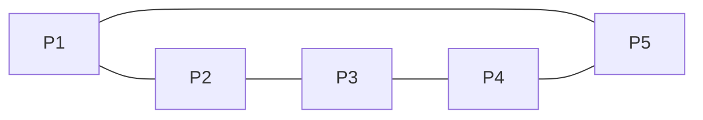

# 2-2 個體關係模型

個體關係模型是探討在一個系統或群體中，各個獨立個體之間如何相互連結、互動的框架。它旨在透過量化或概念化的方式，理解這些關係的結構、模式及其對個體行為和整體系統動態的影響。本章將深入介紹個體關係的核心概念、常見表示方法及其實際應用。

-----

#### 核心概念：個體、關係與圖論

個體關係模型的核心在於識別兩個主要元素：**個體** (Individuals/Nodes) 和**關係** (Relationships/Edges)。

*   **個體 (Individuals/Nodes/Vertices)**
    *   **定義/核心觀念**：指在模型中被分析的獨立實體。這些實體可以是人（在社交網絡中）、動物（在生態系統中）、電腦（在網絡架構中）、文章（在引文網絡中）等任何研究對象。
    *   **例子**：
        *   在學校班級中，每個學生是一個個體。
        *   在生態系中，每種生物物種是一個個體。
        *   在網際網絡中，每台伺服器或電腦是一個個體。
    *   **與相鄰概念的關聯**：個體是模型中的基本單位，其特性（如年齡、職業、生物量、處理能力）通常被稱為「節點屬性」，與其間的「關係」相區分。

*   **關係 (Relationships/Edges/Links)**
    *   **定義/核心觀念**：指個體之間存在的任何形式的連結、互動或依賴。關係可以是直接的、間接的、單向的、雙向的，並且可能具有不同的強度或類型。
    *   **例子**：
        *   兩位學生之間的「朋友」關係。
        *   兩種生物之間的「捕食-被捕食」關係。
        *   兩台電腦之間的「資料傳輸」關係。
    *   **與相鄰概念的關聯**：關係定義了個體之間的結構。沒有關係，個體只是孤立的實體；有了關係，它們便形成了一個網絡或系統。

*   **圖論 (Graph Theory) 作為核心工具**
    *   **定義/核心觀念**：圖論是數學的一個分支，專門研究「圖」(Graph) 這種由節點（個體）和邊（關係）組成的數學結構。它是建立和分析個體關係模型最常用且最強大的工具。
    *   **例子**：一個包含五個朋友（A, B, C, D, E）的社交圈。A和B是朋友，A和C是朋友，B和D是朋友。這可以用一個圖來表示：節點是A, B, C, D, E，邊是(A, B), (A, C), (B, D)。
    *   **與相鄰概念的關聯**：圖論提供了豐富的工具和概念（如路徑、循環、中心性、連通性）來分析個體關係模型的結構和動態。

-----

#### 典型例子與轉換：圖形表示與矩陣/列表

個體關係模型可以透過多種方式來表示，其中最常見的是圖形表示、鄰接矩陣和鄰接列表。

##### 1. 圖形表示 (Graphical Representation)

*   **核心觀念**：將個體表示為點或圓圈，將關係表示為連接這些點的線段或箭頭。
*   **例子**：
    *   **無向圖 (Undirected Graph)**：關係是雙向且對稱的，例如「朋友」關係。如果A是B的朋友，則B也是A的朋友。邊沒有方向。
        *   
    *   **有向圖 (Directed Graph)**：關係是單向的，例如「追蹤」或「指向」關係。如果A追蹤B，B不一定追蹤A。邊有方向性，通常用箭頭表示。
        *   
    *   **加權圖 (Weighted Graph)**：關係具有數值上的強度或成本，例如「合作次數」或「距離」。邊上標有數值。
        *   

##### 2. 鄰接矩陣 (Adjacency Matrix)

*   **核心觀念**：一個 $N \times N$ 的矩陣 $A$，其中 $N$ 是個體的總數。矩陣中的元素 $A_{ij}$ 表示個體 $i$ 和個體 $j$ 之間是否存在關係，以及關係的強度。
*   **推導與表示**：
    *   對於**無權圖**（無向或有向）：
        *   如果 $i$ 到 $j$ 有關係，$A_{ij} = 1$。
        *   如果 $i$ 到 $j$ 沒有關係，$A_{ij} = 0$。
    *   對於**加權圖**：
        *   如果 $i$ 到 $j$ 有關係，$A_{ij} = w_{ij}$（關係權重）。
        *   如果 $i$ 到 $j$ 沒有關係，$A_{ij} = 0$ 或 $\infty$（依據上下文）。
    *   **無向圖的特性**：鄰接矩陣 $A$ 是對稱的，即 $A_{ij} = A_{ji}$。
*   **例子**：考慮上述無向圖的朋友關係：A-B, A-C, B-D。
    個體：A, B, C, D, E。
    $$
    A = \begin{pmatrix}
        & A & B & C & D & E \\
        A & 0 & 1 & 1 & 0 & 0 \\
        B & 1 & 0 & 0 & 1 & 0 \\
        C & 1 & 0 & 0 & 0 & 0 \\
        D & 0 & 1 & 0 & 0 & 0 \\
        E & 0 & 0 & 0 & 0 & 0
    \end{pmatrix}
    $$
*   **與相鄰概念的關聯**：鄰接矩陣便於數學運算（如矩陣乘法可用於計算路徑數量），但對於稀疏圖（關係較少的圖）來說，會佔用大量記憶體。

##### 3. 鄰接列表 (Adjacency List)

*   **核心觀念**：為每個個體維護一個列表，列出所有與該個體有直接關係的個體。
*   **推導與表示**：通常以雜湊表 (Hash Map) 或陣列的形式儲存，其中鍵是個體，值是與之相連的個體列表。
*   **例子**：繼續使用上述無向圖的朋友關係：A-B, A-C, B-D。
    ```
    A: [B, C]
    B: [A, D]
    C: [A]
    D: [B]
    E: []
    ```
*   **與相鄰概念的關聯**：鄰接列表對於稀疏圖來說更加高效節省空間，因為它只儲存實際存在的關係。在遍歷圖（如尋找路徑）時也常常更為便捷。

-----

#### 與相鄰概念的關聯

個體關係模型是許多學科的基礎，與以下概念緊密相關：

*   **網絡分析 (Network Analysis)**
    *   **關聯**：個體關係模型提供了一個網絡的藍圖，而網絡分析則利用圖論的工具來**量化和解釋**這些網絡的結構特性（如中心性、社群結構、網絡密度、路徑長度）以及動態行為（如資訊傳播、疾病擴散）。
    *   **例子**：分析社交網絡中哪個個體最具影響力（中心性），或一個謠言如何在網絡中傳播。

*   **系統動力學 (System Dynamics)**
    *   **關聯**：在系統動力學中，一個系統的行為是由其內部組件（個體）之間的因果關係和回饋迴路決定的。個體關係模型可以幫助**明確這些因果連結**，作為建立系統動力學模型的第一步。
    *   **例子**：經濟模型中，不同的經濟參與者（個體）之間的商品交換、資金流動關係，共同構成經濟系統的動態。

*   **行為經濟學/博弈論 (Behavioral Economics/Game Theory)**
    *   **關聯**：在博弈論中，參與者（個體）的決策和互動是核心。個體關係模型可以**表示參與者之間的相互依賴和影響**，特別是在重複博弈或網絡博弈中，關係結構直接影響博弈結果。
    *   **例子**：在一個小鎮中，兩個競爭的商家（個體）之間的價格戰（關係）會如何影響彼此的收益。

*   **資料庫建模 (Database Modeling)**
    *   **關聯**：實體關係模型 (Entity-Relationship Model, ERM) 是資料庫設計的基礎，它將資料抽象為**實體 (個體) 及其間的關係**。這與個體關係模型的概念高度一致，只是它專注於資料儲存和檢索的邏輯結構。
    *   **例子**：在學生管理系統中，「學生」和「課程」是兩個實體，它們之間存在「選修」關係。

-----

#### 進階內容：關係的特性與動態

個體關係模型不僅限於靜態的二元連結，還可以包含更複雜的特性和動態變化。

##### 1. 關係的特性與類型

*   **同質性 (Homophily) 與異質性 (Heterophily)**
    *   **核心觀念**：同質性是指個體傾向於與和自己相似的個體建立關係（例如，收入相近者交朋友）。異質性則相反，指個體傾向與不同特性的個體建立關係（例如，買家與賣家）。
    *   **影響**：這兩種特性深刻影響網絡結構的形成和資訊在網絡中的流動。

*   **多層次關係 (Multiplex Relationships)**
    *   **核心觀念**：個體之間可能同時存在多種類型的關係。例如，兩個人可以是同事、朋友，同時也是鄰居。多層次關係模型允許同時表示和分析這些不同層面的連結。
    *   **表示**：可以透過多個鄰接矩陣（每個矩陣代表一種關係類型）或多層網絡 (Multiplex Network) 來表示。

##### 2. 動態關係模型

*   **核心觀念**：現實世界中的關係並非靜態不變，它們會隨時間演進、建立、斷裂或改變強度。動態關係模型旨在捕捉和分析這些時間上的變化。
*   **例子**：
    *   社交網絡中的友誼可能會建立或終止。
    *   貿易網絡中，國家之間的貿易量（關係強度）會波動。
*   **表示**：可以透過一系列時間切片 (Time Slices) 的靜態圖，或是使用專門的時序圖 (Temporal Graph) 模型來表示。分析時會涉及關係演化的規律和預測。

-----

#### 常見錯誤與澄清

*   **錯誤一：混淆「個體屬性」與「關係」**
    *   **澄清**：個體屬性是個體本身的特徵（如一個人的年齡、性別），它不涉及其他個體。關係是個體與個體之間的連結。雖然屬性可能影響關係的形成（例如同質性），但兩者本質不同。
*   **錯誤二：將所有關係都視為無向對稱**
    *   **澄清**：並非所有關係都是雙向對稱的。例如，「師生關係」（學生受教於老師，但不一定老師受教於學生）、「資訊傳播」（A傳給B，但B不一定傳給A）都是有向關係。必須根據關係的實際性質判斷其方向性。
*   **錯誤三：忽視關係的動態性，僅建立靜態模型**
    *   **澄清**：雖然靜態模型是分析的基礎，但許多現實世界的系統是動態演進的。關係的建立、消亡、強度的變化對系統行為有重要影響。若研究目的涉及時間因素，應考慮建立動態模型。

-----

#### 小練習（附詳解）

##### 小練習 1: 建立社交圈的關係模型

假設有一個小型社交圈，成員為：Alice (A), Bob (B), Carol (C), David (D), Eve (E)。
他們的關係如下：
*   Alice 和 Bob 是朋友。
*   Alice 追蹤 Carol (單向關係)。
*   Bob 和 David 是朋友。
*   Carol 追蹤 Eve (單向關係)。
*   David 和 Eve 是朋友。
*   Bob 曾經與 Eve 合作過 3 次專案。

**請完成以下任務：**

1.  繪製一張綜合這些關係的**圖形表示**。請區分無向朋友關係和有向追蹤關係。如果可能，也表示合作次數。
2.  建立對應的**鄰接矩陣**，其中：
    *   無向朋友關係用 1 表示（雙向）。
    *   有向追蹤關係用 1 表示（單向）。
    *   合作關係用次數表示，且假設是單向影響（Bob 對 Eve 的合作影響）。
    *   若有多種關係，優先顯示「合作次數」，其次「追蹤」，最後「朋友」。若無關係則為 0。
    *   個體順序為 A, B, C, D, E。

---

**詳解**

**1. 圖形表示**

*   我們使用雙向線表示朋友關係，單向箭頭表示追蹤關係，線旁數字表示合作次數。

```mermaid
graph TD
    A -- 朋友 --> B
    B -- 朋友 --> A
    A --> C (追蹤)
    C --> E (追蹤)
    B -- 朋友 --> D
    D -- 朋友 --> B
    D -- 朋友 --> E
    E -- 朋友 --> D
    B -- 合作(3次) --> E
```

或文字描述：
A --B (朋友)
A --> C (追蹤)
B --D (朋友)
C --> E (追蹤)
D --E (朋友)
B -- E (合作3次，有方向)

**2. 鄰接矩陣**

*   矩陣的行和列順序為 A, B, C, D, E。
*   $A_{ij}$ 代表從 $i$ 到 $j$ 的關係。
*   "朋友"關係是雙向的，所以在 $A_{ij}$ 和 $A_{ji}$ 都標記 1。
*   "追蹤"關係是單向的，只在 $A_{ij}$ 標記 1。
*   "合作"關係在 $A_{BE}$ 標記 3。
*   當有多種關係時，題目要求優先顯示「合作次數」，其次「追蹤」，最後「朋友」。

|     | **A** | **B** | **C** | **D** | **E** |
| :-- | :---- | :---- | :---- | :---- | :---- |
| **A** | 0     | 1     | 1     | 0     | 0     |
| **B** | 1     | 0     | 0     | 1     | 3     |
| **C** | 0     | 0     | 0     | 0     | 1     |
| **D** | 0     | 1     | 0     | 0     | 1     |
| **E** | 0     | 0     | 0     | 1     | 0     |

**矩陣 $A$：**
$$
A = \begin{pmatrix}
    0 & 1 & 1 & 0 & 0 \\
    1 & 0 & 0 & 1 & 3 \\
    0 & 0 & 0 & 0 & 1 \\
    0 & 1 & 0 & 0 & 1 \\
    0 & 0 & 0 & 1 & 0
\end{pmatrix}
$$

*   **$A_{AB}=1$**: Alice 是 Bob 的朋友。
*   **$A_{BA}=1$**: Bob 是 Alice 的朋友。
*   **$A_{AC}=1$**: Alice 追蹤 Carol。
*   **$A_{BD}=1$**: Bob 是 David 的朋友。
*   **$A_{DB}=1$**: David 是 Bob 的朋友。
*   **$A_{CE}=1$**: Carol 追蹤 Eve。
*   **$A_{DE}=1$**: David 是 Eve 的朋友。
*   **$A_{ED}=1$**: Eve 是 David 的朋友。
*   **$A_{BE}=3$**: Bob 與 Eve 合作 3 次。
*   其他為 0。

---

##### 小練習 2: 分析給定鄰接矩陣

給定以下一個社交網絡的鄰接矩陣 $M$ (個體為 P1, P2, P3, P4, P5)：

$$
M = \begin{pmatrix}
    0 & 1 & 0 & 0 & 1 \\
    1 & 0 & 1 & 0 & 0 \\
    0 & 1 & 0 & 1 & 0 \\
    0 & 0 & 1 & 0 & 1 \\
    1 & 0 & 0 & 1 & 0
\end{pmatrix}
$$

**請完成以下任務：**

1.  判斷這個關係模型是**有向圖**還是**無向圖**？請說明理由。
2.  判斷這個關係模型是**加權圖**還是**無權圖**？請說明理由。
3.  繪製這個關係模型的**圖形表示**。
4.  計算每個個體的**關係數量** (度 Degree)。對於無向圖，度是與個體相連的邊數。

---

**詳解**

**1. 判斷有向圖或無向圖**

*   **判斷**：這個關係模型是**無向圖**。
*   **理由**：觀察矩陣 $M$，它是對稱的。即對於任意 $i, j$， $M_{ij} = M_{ji}$。例如，$M_{12}=1$ 且 $M_{21}=1$；$M_{15}=1$ 且 $M_{51}=1$。這表示如果個體 $i$ 與個體 $j$ 有關係，那麼個體 $j$ 也與個體 $i$ 有相同的關係，符合無向圖的定義。

**2. 判斷加權圖或無權圖**

*   **判斷**：這個關係模型是**無權圖**。
*   **理由**：矩陣中所有的非零元素都只有 1。這表示關係的存在與否，而沒有表示關係的強度或數值。

**3. 繪製圖形表示**

*   由於是無向圖，我們使用無箭頭的線段連接節點。



或文字描述：
P1 -- P2
P1 -- P5
P2 -- P3
P3 -- P4
P4 -- P5

**4. 計算每個個體的關係數量 (度 Degree)**

*   對於無向圖，一個個體的度是其鄰接矩陣中對應行（或列）的 1 的總數。

*   **P1 的度**：$M_{11} + M_{12} + M_{13} + M_{14} + M_{15} = 0 + 1 + 0 + 0 + 1 = 2$
*   **P2 的度**：$M_{21} + M_{22} + M_{23} + M_{24} + M_{25} = 1 + 0 + 1 + 0 + 0 = 2$
*   **P3 的度**：$M_{31} + M_{32} + M_{33} + M_{34} + M_{35} = 0 + 1 + 0 + 1 + 0 = 2$
*   **P4 的度**：$M_{41} + M_{42} + M_{43} + M_{44} + M_{45} = 0 + 0 + 1 + 0 + 1 = 2$
*   **P5 的度**：$M_{51} + M_{52} + M_{53} + M_{54} + M_{55} = 1 + 0 + 0 + 1 + 0 = 2$

*   **結果**：
    *   P1 的度 = 2
    *   P2 的度 = 2
    *   P3 的度 = 2
    *   P4 的度 = 2
    *   P5 的度 = 2

-----

#### 延伸閱讀/參考

*   **網絡科學入門**：理解網絡結構、動態和應用。
    *   *《網絡，群體與市場：揭示高度互聯世界的複雜行為》* (Networks, Crowds, and Markets: Reasoning About a Highly Connected World) by David Easley and Jon Kleinberg
*   **圖論基礎**：學習圖論的數學原理和演算法。
    *   *《圖論導引》* (Introduction to Graph Theory) by Douglas B. West
*   **社會網絡分析**：個體關係模型在社會學領域的應用。
    *   *《社會網絡分析：理論、方法與應用》* (Social Network Analysis: Methods and Applications) by Stanley Wasserman and Katherine Faust