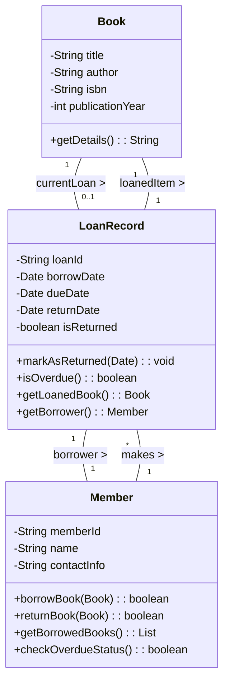

# Chapter 4 物件導向軟體工程

物件導向軟體工程（Object-Oriented Software Engineering, OOSE）是一種軟體開發方法論，它強調透過物件的概念來模擬真實世界的問題領域，從而建構出可維護、可擴展且易於理解的軟體系統。本章將深入探討 OOSE 的核心概念、基本原則及其在軟體開發生命週期中的應用。

-----

## 1. 核心概念與定義

### 1.1 物件導向軟體工程 (OOSE)

#### 定義/核心觀念
物件導向軟體工程是一種結合物件導向分析（OOA）、物件導向設計（OOD）和物件導向程式設計（OOP）的軟體開發範式。它將軟體系統視為一系列相互協作的物件的集合，每個物件都具有狀態（屬性）和行為（方法）。其核心目標是建立模組化、可重用和高彈性的軟體系統。

#### 為何需要 OOSE？
傳統的結構化開發方法側重於功能分解，將系統劃分為一系列函式，資料則作為獨立實體處理。這種方法在需求變動時，往往難以適應，因為功能與資料之間的分離導致修改資料結構可能影響大量函式，反之亦然。OOSE 透過將資料與操作資料的行為封裝在單一的物件中，大大提高了系統的穩定性和可維護性。

-----

### 1.2 物件導向基本原則 (OOP Principles)

物件導向程式設計（OOP）的四大基本原則是 OOSE 的基石。理解並實踐這些原則對於設計出高品質的物件導向系統至關重要。

#### 1.2.1 抽象 (Abstraction)

#### 定義/核心觀念
抽象是從具體事物中提煉出本質特徵的過程，忽略不相關的細節。在軟體中，它允許我們關注物件的「做什麼」而非「如何做」。透過抽象，我們可以建立更高層次的概念模型，簡化複雜系統的理解與設計。

#### 例子
想像一個 `交通工具` 的概念。當我們說到「交通工具」時，我們通常想到它能移動、有啟動和停止的功能，但我們不會立即想到它是汽油驅動還是電力驅動，有幾個輪子等等。`交通工具` 就是一個抽象的概念。

在程式碼中，這可能表現為一個抽象類別或介面：

```java
// Java 範例
public abstract class Vehicle {
    private String brand;
    private String model;

    public Vehicle(String brand, String model) {
        this.brand = brand;
        this.model = model;
    }

    // 抽象方法：所有交通工具都有啟動的能力，但具體如何啟動則由子類別實作
    public abstract void start();

    public void stop() {
        System.out.println(brand + " " + model + " is stopping.");
    }

    public String getInfo() {
        return brand + " " + model;
    }
}
```

#### 與相鄰概念的關聯
抽象是其他 OOP 原則的基礎。沒有抽象，我們就無法定義通用的介面供封裝、繼承和多型使用。

-----

#### 1.2.2 封裝 (Encapsulation)

#### 定義/核心觀念
封裝是將資料（屬性）和操作資料的方法（行為）綑綁在一起，形成一個獨立的單元（物件），並對外部隱藏物件的內部細節，只暴露有限的介面供外部互動。這提供了資訊隱藏（Information Hiding）的機制。

#### 例子
延續 `交通工具` 的例子。一輛 `汽車` 有引擎、變速箱、油箱等內部組件，這些是其內部狀態。駕駛員透過方向盤、油門、煞車等介面來操作汽車，而無需知道引擎的具體工作原理。

在程式碼中，透過 `private` 關鍵字隱藏內部屬性，並提供 `public` 的 getter/setter 方法來存取：

```java
// Java 範例
public class Car extends Vehicle { // 假設 Car 繼承自 Vehicle
    private int fuelLevel; // 內部屬性，對外部隱藏

    public Car(String brand, String model, int fuelLevel) {
        super(brand, model);
        this.fuelLevel = fuelLevel;
    }

    @Override
    public void start() {
        if (fuelLevel > 0) {
            System.out.println(getInfo() + " engine starts with " + fuelLevel + " liters fuel.");
        } else {
            System.out.println(getInfo() + " cannot start, no fuel!");
        }
    }

    // 公開方法，外部可透過此方法加油，但不需要知道 fuelLevel 是如何儲存的
    public void refuel(int amount) {
        this.fuelLevel += amount;
        System.out.println(getInfo() + " refueled " + amount + " liters. Current fuel: " + fuelLevel);
    }

    // 公開方法，外部可透過此方法取得油量，但不能直接修改
    public int getFuelLevel() {
        return fuelLevel;
    }
}
```

#### 與相鄰概念的關聯
封裝是模組化的關鍵。它保護了物件的內部狀態，防止外部不當修改，從而降低了系統的耦合度。這與抽象緊密相關，抽象定義了物件的外部介面，而封裝則實作了這個介面並保護了內部結構。

-----

#### 1.2.3 繼承 (Inheritance)

#### 定義/核心觀念
繼承是一種機制，允許一個類別（子類別/派生類別）繼承另一個類別（父類別/基底類別）的屬性和行為。這促進了程式碼的重用，並建立了一種「is-a」（是一種）的層次關係。

#### 例子
`汽車` `是一種` `交通工具`，`機車` `也是一種` `交通工具`。它們都具有 `交通工具` 的基本特性（如品牌、型號、啟動、停止），但又各自有獨特的屬性（如汽車有輪子數，機車有排氣量）和行為（如汽車可以載更多人）。

```java
// Java 範例
// Vehicle 是父類別 (已在抽象部分定義)

public class Motorcycle extends Vehicle { // Motorcycle 繼承 Vehicle
    private int displacement; // 排氣量，機車特有屬性

    public Motorcycle(String brand, String model, int displacement) {
        super(brand, model);
        this.displacement = displacement;
    }

    @Override
    public void start() { // 實作抽象方法
        System.out.println(getInfo() + " (Displacement: " + displacement + "cc) engine starts with kick-start.");
    }

    public void wheelie() { // 機車特有行為
        System.out.println(getInfo() + " is doing a wheelie!");
    }
}
```

#### 與相鄰概念的關聯
繼承直接促進了程式碼的重用性。它是實現多型的基礎，子類別可以重寫父類別的方法，從而展現出不同的行為。

-----

#### 1.2.4 多型 (Polymorphism)

#### 定義/核心觀念
多型意指「多種形態」，允許不同類型的物件對相同的訊息（方法呼叫）做出不同的響應。這通常透過繼承和介面實現，使得父類別的引用可以指向其任何子類別的實例，並呼叫子類別特有的方法實作。

#### 例子
我們有一個 `交通工具` 類別的列表，其中包含 `汽車` 和 `機車` 的實例。當我們對列表中的每個 `交通工具` 呼叫 `start()` 方法時，`汽車` 會執行其 `start()` 邏輯（檢查油量），而 `機車` 則執行其 `start()` 邏輯（踢發）。

```java
// Java 範例
public class PolymorphismDemo {
    public static void main(String[] args) {
        Vehicle car = new Car("Toyota", "Camry", 50);
        Vehicle motorcycle = new Motorcycle("Yamaha", "YZF-R3", 321);

        // 儘管變數類型都是 Vehicle，但實際呼叫的是各自子類別的 start() 方法
        car.start(); // 輸出: Toyota Camry engine starts with 50 liters fuel.
        motorcycle.start(); // 輸出: Yamaha YZF-R3 (Displacement: 321cc) engine starts with kick-start.

        // 建立一個交通工具的陣列
        Vehicle[] vehicles = new Vehicle[2];
        vehicles[0] = car;
        vehicles[1] = motorcycle;

        for (Vehicle v : vehicles) {
            v.start(); // 展現多型
        }
    }
}
```

#### 與相鄰概念的關聯
多型是 OOSE 實現彈性和擴展性的強大工具。它依賴於繼承（或介面實作）來提供不同的實作，並透過抽象來定義共同的介面。多型使得在不修改現有程式碼的情況下，可以輕鬆地新增新的類別並整合到系統中。

-----

### 1.3 關聯、聚合、組合 (Association, Aggregation, Composition)

這些是描述物件之間關係的重要概念。

#### 定義/核心觀念
*   **關聯 (Association):** 最寬泛的關係，表示兩個或多個物件之間有邏輯上的連接。通常是雙向的，但也可以是單向的。
    *   **例子:** `學生` `修讀` `課程`。
*   **聚合 (Aggregation):** 一種特殊的關聯，表示「部分-整體」的關係，但部分可以獨立於整體存在。整體與部分的生命週期是獨立的。
    *   **例子:** `大學` `包含` `系所`。即使大學不存在，系所（例如作為獨立機構）仍然可以存在。
*   **組合 (Composition):** 一種更強的「部分-整體」關係，表示部分的生命週期完全依賴於整體。如果整體被銷毀，部分也會隨之銷毀。
    *   **例子:** `汽車` `擁有` `引擎`。如果汽車被銷毀，引擎（作為該汽車的一部分）也就不復存在了。

#### 例子
```java
// Java 範例
// 關聯: Student 和 Course 獨立存在，互相引用
class Course {
    private String title;
    // ...
}

class Student {
    private String name;
    private List<Course> enrolledCourses; // 學生與課程的關聯
    // ...
}

// 聚合: Department 包含 Professor，但 Professor 可以在其他 Department 工作或獨立存在
class Professor {
    private String name;
    // ...
}

class Department {
    private String name;
    private List<Professor> professors; // 聚合關係：系所包含教授
    // ...
}

// 組合: Car 擁有 Engine，Engine 的生命週期依賴於 Car
class Engine {
    private String type;
    public Engine(String type) { this.type = type; }
    // ...
}

class Car_Composition {
    private String model;
    private Engine engine; // 組合關係：汽車擁有引擎

    public Car_Composition(String model, String engineType) {
        this.model = model;
        this.engine = new Engine(engineType); // 引擎在 Car 建立時一同建立
    }
    // ...
}
```

#### 與相鄰概念的關聯
這些關係描述了物件之間如何協作，是物件導向設計中建構複雜系統的關鍵。正確理解和應用這些關係有助於建立低耦合、高內聚的系統。聚合和組合是抽象化更高層次關係的具體化，進一步提升了模組化能力。

-----

## 2. 典型例子與轉換/推導：從問題領域到物件模型

本節將以一個簡單的「圖書館管理系統」為例，展示如何從需求描述中識別物件、屬性、行為和關係，並將其轉化為初步的物件模型。

#### 核心觀念
物件導向分析（OOA）的目標是建立一個領域模型，它精確地反映了問題領域的概念和它們之間的關係。物件導向設計（OOD）則在此基礎上，考慮到實作細節、效能、擴展性等因素，將領域模型轉化為可執行的軟體設計。

#### 例子：圖書館管理系統

**需求描述簡化版：**
圖書館需要管理書籍（包含書名、作者、ISBN、出版年份）。讀者可以註冊成為會員（包含姓名、會員ID、聯絡資訊）。會員可以借閱書籍，每本書在任何時候只能被一位讀者借閱。系統需要記錄借閱日期和應還日期。會員在借閱前必須檢查是否有逾期未還的書籍。

**推導步驟：**

1.  **識別核心物件（名詞分析法）：**
    從需求描述中提取關鍵名詞，這些名詞很可能對應到系統中的物件或類別。
    *   圖書館 (Library)
    *   書籍 (Book)
    *   作者 (Author)
    *   ISBN
    *   出版年份 (PublicationYear)
    *   讀者 (Reader) / 會員 (Member)
    *   會員ID (MemberID)
    *   聯絡資訊 (ContactInfo)
    *   借閱 (Borrowing) / 借閱記錄 (LoanRecord)
    *   借閱日期 (BorrowDate)
    *   應還日期 (DueDate)

    初步篩選與合併：
    *   `圖書館` 可能是系統本身，而不是一個獨立管理的物件。
    *   `作者` 可能是 `書籍` 的屬性，或單獨的類別如果需要管理作者資訊（例如作者的出版書籍列表）。為簡化起見，暫定為 `書籍` 屬性。
    *   `ISBN`、`出版年份` 是 `書籍` 的屬性。
    *   `讀者`/`會員` 可以合併為 `會員 (Member)` 類別。
    *   `會員ID`、`聯絡資訊` 是 `會員` 的屬性。
    *   `借閱` 是一個動作，但 `借閱記錄` 是一個實體，可能需要一個獨立的類別來儲存 `借閱日期`、`應還日期` 以及關聯的 `書籍` 和 `會員`。

    **初步物件：** `Book`, `Member`, `LoanRecord`

2.  **識別屬性（物件的狀態）：**
    *   `Book`:
        *   `title` (書名)
        *   `author` (作者)
        *   `isbn` (ISBN)
        *   `publicationYear` (出版年份)
        *   `isBorrowed` (是否被借閱中) - 這是一個狀態，但也可以透過與 `LoanRecord` 的關聯來推導。
    *   `Member`:
        *   `memberId` (會員ID)
        *   `name` (姓名)
        *   `contactInfo` (聯絡資訊)
        *   `hasOverdueBooks` (是否有逾期書) - 這也是一個狀態，可以透過計算得知。
    *   `LoanRecord`:
        *   `loanId` (借閱ID)
        *   `borrowDate` (借閱日期)
        *   `dueDate` (應還日期)
        *   `returnDate` (實際歸還日期，如果已還)

3.  **識別行為（物件能做什麼）：**
    *   `Book`:
        *   `borrow()` (被借閱)
        *   `returnBook()` (被歸還)
        *   `getDetails()` (獲取詳情)
    *   `Member`:
        *   `borrowBook(Book book)` (借書)
        *   `returnBook(Book book)` (還書)
        *   `getBorrowedBooks()` (查詢已借書籍)
        *   `checkOverdueStatus()` (檢查逾期狀態)
    *   `LoanRecord`:
        *   `markAsReturned(Date returnDate)` (標記為已還)
        *   `isOverdue()` (檢查是否逾期)

4.  **識別物件之間的關係：**

    *   **`Member` 與 `Book`:** `Member` `借閱` `Book`。
        *   一個 `Member` 可以借閱多本 `Book`。
        *   一本 `Book` 在任何時候只能被一個 `Member` 借閱（如果它已被借閱）。
        *   這是一個多對多關係，但由於「一本書只能被一位讀者借閱」，所以需要在中間引入一個關聯物件來處理。`LoanRecord` 正是為此服務的。

    *   **`LoanRecord` 與 `Member`:** `LoanRecord` `屬於` `Member`。
        *   一個 `LoanRecord` 關聯一個 `Member`。
        *   一個 `Member` 可以有多個 `LoanRecord`。
        *   關係：`Member` --- `1..*` `LoanRecord`

    *   **`LoanRecord` 與 `Book`:** `LoanRecord` `關聯` `Book`。
        *   一個 `LoanRecord` 關聯一本 `Book`。
        *   一本 `Book` 可以有多個歷史 `LoanRecord`，但只有一個是當前活動的。
        *   關係：`Book` --- `1` `LoanRecord` (當前) / `Book` --- `1..*` `LoanRecord` (歷史)
        *   我們可以讓 `Book` 持有一個當前 `LoanRecord` 的引用（組合或聚合），或者在 `LoanRecord` 中引用 `Book`。考慮到書的生命週期獨立於借閱記錄，`LoanRecord` 引用 `Book` 更合理。

    **初步類別圖（概念層次）：**

    ```mermaid
    classDiagram
        class Book {
            -String title
            -String author
            -String isbn
            -int publicationYear
            +getDetails()
        }

        class Member {
            -String memberId
            -String name
            -String contactInfo
            +borrowBook(Book)
            +returnBook(Book)
            +getBorrowedBooks()
            +checkOverdueStatus()
        }

        class LoanRecord {
            -String loanId
            -Date borrowDate
            -Date dueDate
            -Date returnDate
            +markAsReturned(Date)
            +isOverdue()
        }

        Member "1" -- "*" LoanRecord : makes >
        Book "1" -- "0..1" LoanRecord : hasCurrent >
        LoanRecord "1" -- "1" Book : references >
    ```
    *備註：`Book "1" -- "0..1" LoanRecord` 表示一本書目前最多有一個借閱記錄。`LoanRecord "1" -- "1" Book` 表示一個借閱記錄必須關聯一本書。*

#### 轉換/推導
這個初步的物件模型是 OOA 的結果。從這裡到 OOD，我們會進一步細化：
*   **介面設計:** 考慮哪些行為應該抽象為介面，例如 `IBorrowable`。
*   **具體實作細節:** `contactInfo` 可以是一個單獨的 `Address` 或 `ContactDetails` 類別嗎？
*   **錯誤處理與邊界條件:** 借閱時如何處理書籍已借出的情況？
*   **設計模式應用:** 例如，單例模式用於圖書館系統的某些核心服務。
*   **持久化機制:** 如何將這些物件的狀態儲存到資料庫中？

透過這種方式，我們將真實世界的複雜性逐步分解為可管理的、相互協作的物件，並應用 OOP 原則來建構穩健的軟體。

-----

## 3. 與相鄰概念的關聯

### 3.1 與結構化方法 (Structured Methodologies) 的比較

#### 核心觀念
結構化方法（例如：結構化分析、結構化設計）以功能為中心，將系統分解為一系列的程序和資料流程。物件導向方法則以物件為中心，將資料和行為緊密結合。

#### 比較
| 特性         | 結構化方法 (Structured Methodologies)                               | 物件導向軟體工程 (OOSE)                                      |
| :----------- | :------------------------------------------------------------------ | :----------------------------------------------------------- |
| **關注點**   | 功能分解、程序、資料流程                                            | 物件（資料與行為的組合）、類別、繼承、多型                   |
| **模型工具** | 資料流圖 (DFD)、實體關係圖 (ERD)、結構圖 (Structure Chart)       | 統一塑模語言 (UML) - 類別圖、順序圖、用例圖等                 |
| **演進性**   | 需求變更時，常需大範圍修改，維護成本高。                            | 易於擴展和維護，局部變更通常不會影響整個系統（因封裝）。       |
| **重用性**   | 函式或模組重用困難，因為與特定資料結構綁定。                        | 類別和物件設計為可重用元件，透過繼承和組合實現重用。           |
| **耦合性**   | 功能與資料分離，往往導致功能之間或功能與資料之間高度耦合。          | 透過封裝降低耦合，物件之間透過定義明確的介面互動。             |
| **適合場景** | 需求穩定、功能流程固定的系統。                                      | 需求變化頻繁、複雜度高、需要高彈性與可擴展性的系統。           |

#### 與相鄰概念的關聯
OOSE 的核心優勢在於其處理複雜性和變化的能力，這與結構化方法形成鮮明對比。理解兩者的差異有助於在不同專案背景下選擇最合適的開發範式。

-----

### 3.2 與敏捷開發 (Agile Development) 的整合

#### 核心觀念
敏捷開發是一組以疊代、增量和協作為特點的軟體開發方法。OOSE 是一種設計和實作軟體的方法論。兩者並非互相排斥，而是可以良好地結合。

#### 關聯
*   **疊代與增量:** OOSE 的模組化特性非常適合敏捷開發的疊代增量式開發。每次疊代可以專注於實現部分物件的功能，並逐步擴展。
*   **快速適應變化:** OOSE 的原則（如封裝、多型）使得系統在需求變動時更容易調整，這與敏捷強調的「響應變化」不謀而合。
*   **設計模式:** 在敏捷開發中，開發者會頻繁進行重構。物件導向的設計模式提供了經過驗證的解決方案，可以在重構時應用，以提升系統品質。
*   **共同目標:** 兩者都追求交付高品質、符合客戶需求的軟體。OOSE 提供了技術層面的指導，而敏捷則提供了過程層面的框架。

#### 與相鄰概念的關聯
敏捷開發提供了快速、靈活的開發流程，而 OOSE 則為在這些流程中構建可持續、高品質的程式碼提供了基礎。許多敏捷實踐，如測試驅動開發 (TDD) 和重構，都受益於物件導向的設計。

-----

### 3.3 與設計模式 (Design Patterns) 的關聯

#### 核心觀念
設計模式是針對在特定上下文、特定問題的解決方案的通用、可重用的模式。它們不是可以直接轉換為程式碼的成品設計，而是描述了如何在物件之間建立關係以解決特定設計問題。設計模式是物件導向原則的具體實踐。

#### 關聯
*   **最佳實踐:** 設計模式是物件導向設計的「知識庫」，提供了許多經過驗證的最佳實踐。
*   **解決常見問題:** OOSE 提供了抽象、封裝等工具，而設計模式則告訴我們如何有效地組合這些工具來解決常見的軟體設計挑戰（例如，如何建立物件、如何組織物件之間的通訊、如何讓物件家族化等）。
*   **提高表達力:** 熟悉設計模式的開發者，在討論設計時可以使用標準術語，提高溝通效率。
*   **促成彈性與擴展性:** 大多數設計模式的核心目標是增強系統的彈性、可重用性和可擴展性，這與 OOSE 的目標高度一致。例如，策略模式利用多型來實現演算法的替換。

#### 與相鄰概念的關聯
設計模式是 OOSE 從理論走向實踐的橋樑。它們是對 OOP 原則的進一步應用和提煉，是更高層次的抽象。理解 OOP 原則是理解設計模式的基礎。

-----

## 4. 進階內容：UML 簡介

### 4.1 統一塑模語言 (UML)

#### 定義/核心觀念
統一塑模語言 (Unified Modeling Language, UML) 是一種視覺化、標準化的語言，用於軟體系統的規範、視覺化、建構和文件化。它提供了一套豐富的圖形符號和規則，用來描述物件導向系統的各個方面，從高層次的業務流程到低層次的程式碼結構。

#### 主要圖表類型 (OOSE 常用)
UML 包含多種圖表類型，用於從不同視角描述系統。在 OOSE 中，以下圖表特別常用：

*   **類別圖 (Class Diagram):** 靜態視圖，描述系統中的類別、介面、它們的屬性、方法以及類別之間的關係（繼承、實作、關聯、聚合、組合）。這是 OOA/D 中最核心的圖表之一。
*   **順序圖 (Sequence Diagram):** 動態視圖，描述物件之間在特定時間順序上的訊息（方法呼叫）互動。它顯示了物件如何協同工作以實現某個用例。
*   **用例圖 (Use Case Diagram):** 描述系統外部參與者 (Actor) 與系統提供功能 (Use Case) 之間的關係，用於捕捉系統的功能需求。

#### 例子：類別圖範例
基於前文的圖書館系統，一個更詳細的類別圖可能包含可見性修飾符、更精確的關係重數等。



#### 與相鄰概念的關聯
UML 是 OOSE 的標準化「語言」。它不是 OOSE 的原則本身，而是將 OOSE 的分析和設計結果視覺化、溝通和文件化的主要工具。它幫助開發團隊更好地理解物件導向模型，並在開發過程中保持一致性。

-----

## 5. 常見錯誤與澄清

### 5.1 過度繼承 (Over-Inheritance)

#### 常見錯誤
許多初學者在應用繼承時，傾向於在任何「is-a」關係下都使用繼承，即使這種關係並不穩定或過於僵化。例如，將 `正方形` 繼承自 `長方形`。儘管從數學上看，正方形是一種長方形，但在程式設計中，這會導致問題（例如，如果 `長方形` 有 `setWidth()` 和 `setHeight()` 方法，設定 `正方形` 的寬度為 10、高度為 20 會違反 `正方形` 的不變性）。

#### 澄清
繼承應該用於表示穩定的、具有共同行為和狀態的類型層次結構。當子類別只是簡單地「擁有」父類別的部分功能，而非「是」父類別的一種特殊形式時，應考慮使用**組合 (Composition)** 而非繼承。這遵循了「**優先使用組合而非繼承 (Prefer Composition over Inheritance)**」的原則。組合提供了更大的彈性，因為你可以動態地改變物件的行為，而無需修改其繼承層次結構。

-----

### 5.2 上帝物件 (God Object / God Class)

#### 常見錯誤
將過多的職責和功能集中在一個類別中，導致這個類別變得龐大、複雜，難以理解、測試和維護。這個類別就像「上帝」一樣，知道一切，控制一切。

#### 澄清
這違反了物件導向設計的**單一職責原則 (Single Responsibility Principle, SRP)**。SRP 指出一個類別應該只有一個改變的理由，即它只負責一項功能。
避免上帝物件的方法：
*   **分解職責:** 將龐大類別的功能分解到更小的、專注於單一職責的類別中。
*   **協作而非集中:** 讓多個小物件透過定義清晰的介面協作，而不是讓一個大物件控制所有。
*   **重構:** 當發現類別開始變得過於複雜時，及時進行重構。

-----

### 5.3 誤解多型：混淆多型與函式重載 (Overloading)

#### 常見錯誤
將函式重載 (Overloading) 誤認為是多型 (Polymorphism) 的一種形式。函式重載是指在同一個類別中，有多個名稱相同但參數列表不同的方法。

#### 澄清
*   **函式重載 (Overloading):** 發生在**編譯時期**，依據方法的參數個數、類型和順序來決定呼叫哪一個方法。它與物件的運行時類型無關。
    ```java
    class Calculator {
        int add(int a, int b) { return a + b; }
        double add(double a, double b) { return a + b; } // 重載
    }
    ```
*   **多型 (Polymorphism):** 發生在**運行時期**，透過父類別引用指向子類別物件，並呼叫子類別重寫（override）的方法，使得相同的方法呼叫在不同物件上產生不同的行為。這是 OOSD 真正的靈活性來源。
    ```java
    class Animal { void makeSound() { System.out.println("Animal makes sound"); } }
    class Dog extends Animal { @Override void makeSound() { System.out.println("Woof!"); } }
    class Cat extends Animal { @Override void makeSound() { System.out.println("Meow!"); } }

    Animal myAnimal = new Dog();
    myAnimal.makeSound(); // 運行時呼叫 Dog 的 makeSound()
    ```
多型是 OOSE 實現彈性擴展的關鍵，而函式重載只是提高程式碼可讀性的一種語法糖。

-----

## 6. 小練習 (附詳解)

### 小練習 1：電商系統的物件識別與關係

#### 題目
請為一個簡化的電商系統設計初步的類別模型。該系統需要管理：
1.  **用戶 (User):** 每個用戶有用戶ID、姓名、電子郵件。用戶可以下訂單。
2.  **商品 (Product):** 每個商品有商品ID、名稱、價格、庫存量。
3.  **訂單 (Order):** 每個訂單有訂單ID、下單日期、總金額、訂單狀態（待處理、已出貨、已完成）。一個訂單包含多個商品，每個商品在訂單中有一個購買數量。

請：
1.  識別出核心類別。
2.  為每個類別定義至少 3 個屬性。
3.  為每個類別定義至少 2 個方法。
4.  繪製或描述類別之間的關係（關聯、聚合、組合、繼承）。

#### 詳解

1.  **識別核心類別：**
    根據名詞分析，核心類別為：`User` (用戶), `Product` (商品), `Order` (訂單)。
    另外，由於一個訂單包含多個商品且有各自的購買數量，我們需要一個中間類別來表示訂單中的「項目」，通常稱為 `OrderItem` (訂單項目) 或 `LineItem`。

2.  **為每個類別定義屬性：**

    *   `User`:
        *   `userId` (String)
        *   `name` (String)
        *   `email` (String)
    *   `Product`:
        *   `productId` (String)
        *   `name` (String)
        *   `price` (double)
        *   `stock` (int)
    *   `Order`:
        *   `orderId` (String)
        *   `orderDate` (Date)
        *   `totalAmount` (double)
        *   `status` (String - 例如 "Pending", "Shipped", "Completed")
    *   `OrderItem`:
        *   `itemId` (String)
        *   `quantity` (int)
        *   `subtotal` (double)

3.  **為每個類別定義方法：**

    *   `User`:
        *   `placeOrder(ShoppingCart cart): Order`
        *   `viewOrderHistory(): List<Order>`
    *   `Product`:
        *   `getDetails(): String`
        *   `updateStock(int change): boolean`
    *   `Order`:
        *   `calculateTotal(): double`
        *   `updateStatus(String newStatus): void`
        *   `addOrderItem(Product product, int quantity): void`
    *   `OrderItem`:
        *   `calculateSubtotal(): double`
        *   `getProduct(): Product` (返回關聯的商品)

4.  **類別之間的關係：**

    *   **`User` 與 `Order`:** 一個 `User` 可以下多個 `Order`。一個 `Order` 屬於一個 `User`。
        *   關係：關聯 (Association)
        *   重數：`User` "1" -- "*" `Order`
    *   **`Order` 與 `OrderItem`:** 一個 `Order` 包含多個 `OrderItem`。一個 `OrderItem` 屬於一個 `Order`。`OrderItem` 的生命週期依賴於 `Order`。
        *   關係：組合 (Composition)
        *   重數：`Order` "1" -- "*" `OrderItem`
    *   **`OrderItem` 與 `Product`:** 一個 `OrderItem` 引用一個 `Product`。一個 `Product` 可以被多個 `OrderItem` 引用（在不同的訂單中）。
        *   關係：關聯 (Association)
        *   重數：`OrderItem` "1" -- "1" `Product`

    **類別圖描述：**

    ```mermaid
    classDiagram
        class User {
            -String userId
            -String name
            -String email
            +placeOrder(ShoppingCart): Order
            +viewOrderHistory(): List<Order>
        }

        class Product {
            -String productId
            -String name
            -double price
            -int stock
            +getDetails(): String
            +updateStock(int): boolean
        }

        class Order {
            -String orderId
            -Date orderDate
            -double totalAmount
            -String status
            -List<OrderItem> items
            +calculateTotal(): double
            +updateStatus(String): void
            +addOrderItem(Product, int): void
        }

        class OrderItem {
            -String itemId
            -int quantity
            -double subtotal
            +calculateSubtotal(): double
            +getProduct(): Product
        }

        User "1" -- "*" Order : places >
        Order "1" *-- "*" OrderItem : contains >
        OrderItem "1" -- "1" Product : references >
    ```

-----

### 小練習 2：應用繼承與多型設計動物園系統

#### 題目
你需要為一個動物園系統設計一個簡單的物件模型，展示繼承和多型的應用。
1.  建立一個抽象的 `Animal` 類別，包含共同的屬性（如 `name`）和一個抽象方法 `makeSound()`。
2.  建立兩個具體的子類別 `Lion` 和 `Penguin`，它們都繼承自 `Animal`，並實作各自的 `makeSound()` 方法。`Lion` 還有一個特有方法 `hunt()`，`Penguin` 有一個特有方法 `swim()`。
3.  在主程式中，建立一個 `Animal` 類型的列表或陣列，放入 `Lion` 和 `Penguin` 的實例，並迭代呼叫它們的 `makeSound()` 方法，展示多型。

#### 詳解

1.  **建立抽象的 `Animal` 類別：**

    ```java
    // Java 範例
    public abstract class Animal {
        protected String name;

        public Animal(String name) {
            this.name = name;
        }

        public String getName() {
            return name;
        }

        // 抽象方法，所有動物都會發出聲音，但具體聲音不同
        public abstract void makeSound();
    }
    ```

2.  **建立 `Lion` 和 `Penguin` 子類別：**

    ```java
    // Java 範例
    public class Lion extends Animal {
        public Lion(String name) {
            super(name);
        }

        @Override
        public void makeSound() {
            System.out.println(name + " says: Roar!");
        }

        // Lion 特有方法
        public void hunt() {
            System.out.println(name + " is hunting for prey.");
        }
    }

    public class Penguin extends Animal {
        public Penguin(String name) {
            super(name);
        }

        @Override
        public void makeSound() {
            System.out.println(name + " says: Squawk!");
        }

        // Penguin 特有方法
        public void swim() {
            System.out.println(name + " is swimming gracefully.");
        }
    }
    ```

3.  **在主程式中展示多型：**

    ```java
    // Java 範例
    import java.util.ArrayList;
    import java.util.List;

    public class ZooSimulator {
        public static void main(String[] args) {
            // 建立 Animal 類型的變數，但實例化為子類別物件
            Animal simba = new Lion("Simba");
            Animal mumble = new Penguin("Mumble");

            // 呼叫共同方法，展現多型
            simba.makeSound(); // 輸出: Simba says: Roar!
            mumble.makeSound(); // 輸出: Mumble says: Squawk!

            System.out.println("-----");

            // 建立 Animal 類型的列表
            List<Animal> animalsInZoo = new ArrayList<>();
            animalsInZoo.add(simba);
            animalsInZoo.add(mumble);
            animalsInZoo.add(new Lion("Nala"));
            animalsInZoo.add(new Penguin("Pingu"));

            System.out.println("Animals in the zoo making sounds:");
            for (Animal animal : animalsInZoo) {
                animal.makeSound(); // 每個動物都呼叫自己的 makeSound 實作
            }

            // 注意：無法直接呼叫子類別特有方法，除非向下轉型
            // simba.hunt(); // 這會編譯錯誤，因為 simba 被宣告為 Animal 類型
            // 為了呼叫 hunt() 或 swim()，需要進行類型檢查和向下轉型
            System.out.println("-----");
            for (Animal animal : animalsInZoo) {
                if (animal instanceof Lion) {
                    ((Lion) animal).hunt(); // 向下轉型為 Lion 才能呼叫 hunt()
                } else if (animal instanceof Penguin) {
                    ((Penguin) animal).swim(); // 向下轉型為 Penguin 才能呼叫 swim()
                }
            }
        }
    }
    ```

#### 概念驗證
這個練習清晰地展示了：
*   **抽象:** `Animal` 類別定義了所有動物的共同行為 `makeSound()`，但沒有具體實作。
*   **繼承:** `Lion` 和 `Penguin` 繼承了 `Animal` 的 `name` 屬性，並實作了 `makeSound()` 方法。
*   **多型:** `Animal` 類型的列表可以儲存不同子類別的物件，當呼叫 `makeSound()` 方法時，每個物件都會執行其自身特有的實作。這使得系統具有良好的擴展性，即使未來新增其他動物類型（如 `Elephant`），也無需修改 `ZooSimulator` 中的迴圈邏輯。

-----

## 7. 延伸閱讀/參考

*   **經典書籍：**
    *   **"Object-Oriented Analysis and Design with Applications"** by Grady Booch: OOSE 的經典著作之一，深入淺出地介紹了物件導向分析與設計。
    *   **"Design Patterns: Elements of Reusable Object-Oriented Software"** (Gang of Four, GoF): 設計模式領域的聖經，對於理解如何應用 OOP 原則來解決常見設計問題至關重要。
    *   **"Clean Code: A Handbook of Agile Software Craftsmanship"** by Robert C. Martin: 強調程式碼的可讀性、可維護性和擴展性，其中包含了許多基於 OOP 原則的實踐建議。
    *   **"Head First Design Patterns"** by Eric Freeman, Elisabeth Robson, Bert Bates, Kathy Sierra: 以非常生動有趣的方式講解設計模式，適合初學者。

*   **UML 相關：**
    *   **"UML Distilled: A Brief Guide to the Standard Object Modeling Language"** by Martin Fowler: 簡潔實用的 UML 指南。

*   **線上資源：**
    *   **Refactoring Guru (設計模式):** [https://refactoring.guru/](https://refactoring.guru/) 提供多種語言的設計模式範例與詳細解釋。
    *   **Wikipedia (物件導向程式設計):** 提供豐富的概念解釋和歷史背景。
    *   **各程式語言官方文件: (Java, C#, Python 等):** 詳細解釋其物件導向特性的使用方法。

透過深入閱讀這些資源，讀者將能更全面地掌握物件導向軟體工程的精髓，並將其應用於實際的軟體開發工作中。