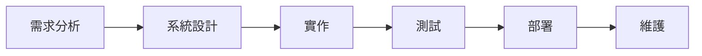
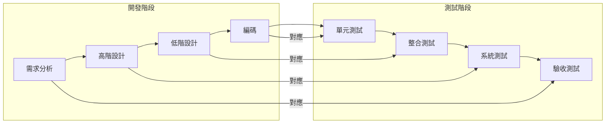
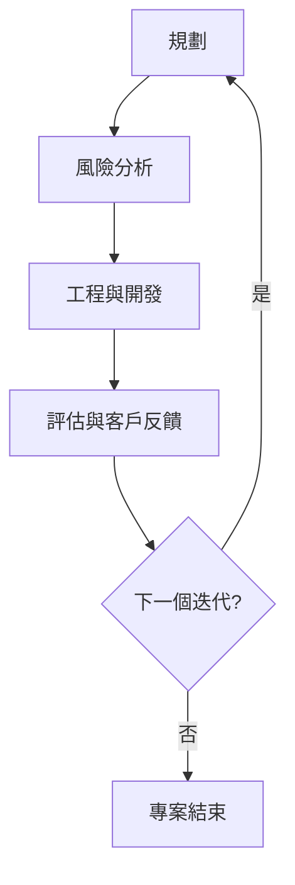
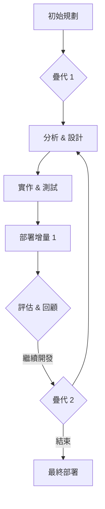

# 第一章：軟體工程與系統開發導論

本章將引導你進入軟體工程與系統開發的領域，從核心概念、傳統開發模型，到當代主流的敏捷方法，讓你對軟體系統的建造過程有全面的理解。

-----

## 1.1 核心概念與定義

### 1.1.1 軟體工程 (Software Engineering)

#### 核心觀念
軟體工程是一門應用科學，它將工程原則系統化、量化地應用到軟體開發、運營與維護的整個過程中。其核心目標是在預算內、時間內，開發出高品質且符合使用者需求的軟體產品。

#### 定義
根據 IEEE 定義，軟體工程是「研究軟體設計、實作、測試和維護的系統化方法，即將工程化方法應用到軟體的開發中」。

#### 與相鄰概念的關聯
*   **與「程式設計 (Programming)」的關聯**：程式設計是軟體工程的一部分，是具體實現軟體功能的編碼活動。軟體工程則涵蓋了程式設計之外的規劃、分析、設計、測試、部署與維護等更廣泛的階段。
*   **與「電腦科學 (Computer Science)」的關聯**：電腦科學研究計算的理論基礎和實際應用。軟體工程是電腦科學的一個分支，專注於如何有效地構建實用、可靠的軟體系統。

-----

### 1.1.2 系統開發 (System Development)

#### 核心觀念
系統開發是一個更廣泛的概念，它不僅包括軟體，還可能包含硬體、人員、流程、資料等所有構成一個完整資訊系統的要素。其目標是建立一個能夠解決特定業務問題或滿足特定組織需求的完整解決方案。

#### 定義
系統開發是指從識別需求、設計、實作、測試、部署到維護一個完整資訊系統的整體過程。

#### 與相鄰概念的關聯
*   **與「軟體開發 (Software Development)」的關聯**：軟體開發是系統開發中的關鍵組成部分，專注於軟體的設計與建構。一個大型資訊系統的開發，通常會包含多個軟體開發子專案。
*   **與「業務分析 (Business Analysis)」的關聯**：業務分析是系統開發的起始階段，旨在理解業務需求，並將其轉化為系統功能需求。

-----

### 1.1.3 軟體開發生命週期 (Software Development Life Cycle, SDLC)

#### 核心觀念
SDLC 是一個描述軟體從概念到廢棄的整個生命週期中，所包含的各種活動和階段的框架。它提供了一個結構化的方法來管理和控制軟體開發過程，確保系統能夠按時、按預算、高品質地交付。

#### 典型階段
SDLC 通常包含以下主要階段（具體劃分可能因模型而異）：

1.  **規劃 (Planning)**：
    *   定義專案範圍、目標、資源、時程與預算。
    *   進行可行性分析（技術、經濟、營運）。
    *   風險識別與初步評估。
2.  **需求分析 (Requirements Analysis)**：
    *   與利害關係人溝通，收集、分析、定義和文件化使用者與系統需求。
    *   產出需求規格文件 (SRS)。
3.  **設計 (Design)**：
    *   根據需求規格，設計系統的架構、模組、資料庫、使用者介面等。
    *   包括高階設計（系統架構）與低階設計（模組內部實現細節）。
4.  **實作 (Implementation / Coding)**：
    *   根據設計規格，編寫、建構軟體程式碼。
    *   進行單元測試。
5.  **測試 (Testing)**：
    *   驗證軟體是否符合需求規格，並找出缺陷。
    *   包含單元測試、整合測試、系統測試、驗收測試等。
6.  **部署 (Deployment)**：
    *   將開發完成且通過測試的軟體安裝到實際運營環境中，供使用者使用。
    *   包括配置、資料遷移、使用者培訓等。
7.  **維護 (Maintenance)**：
    *   軟體上線後的持續活動，包括修復缺陷、提升性能、功能增強、適應新環境等。

#### 與相鄰概念的關聯
SDLC 是軟體工程方法論的具體應用模式，是管理軟體開發專案的核心框架。不同的 SDLC 模型（如瀑布、敏捷）提供了不同的策略來實踐這些階段。

-----

## 1.2 典型的 SDLC 模型

不同的專案特性和組織文化需要不同的開發方法。SDLC 模型為這些方法提供了結構化的框架。

### 1.2.1 瀑布模型 (Waterfall Model)

#### 核心觀念
瀑布模型是軟體開發中最傳統且線性的模型。它將開發過程嚴格劃分為一系列順序執行的階段，每個階段的成果都作為下一個階段的輸入，且一旦完成，通常不允許返回前一個階段。

#### 流程與推導
1.  **需求分析**：全面收集並文件化所有需求。
2.  **系統設計**：根據需求設計系統架構。
3.  **實作**：編寫程式碼。
4.  **測試**：驗證程式碼符合設計與需求。
5.  **部署**：發布軟體。
6.  **維護**：軟體運行後的修改與增強。

#### 優缺點
*   **優點**：
    *   **簡單易懂**：流程清晰，易於管理和理解。
    *   **文件化嚴謹**：每個階段都會產生詳細的文檔，有助於知識傳承。
    *   **適合需求穩定專案**：對需求非常明確且預期不會變化的專案表現良好。
*   **缺點**：
    *   **彈性差**：一旦進入後續階段，修改前期需求非常困難且成本高。
    *   **風險後移**：只有在後期測試階段才能發現潛在問題，導致修復成本巨大。
    *   **客戶參與度低**：客戶通常只能在需求分析初期和驗收階段參與。
    *   **漫長的交付週期**：軟體通常要等到所有階段完成後才能交付。

#### 與相鄰概念的關聯
瀑布模型是最基礎的 SDLC 模型，許多後續模型（如 V 模型、螺旋模型）都是針對其缺點進行改進和延伸。

-----

### 1.2.2 V 模型 (V-Model)

#### 核心觀念
V 模型是瀑布模型的延伸，強調開發與測試活動的對應關係。它將開發過程的每個階段與其相對應的測試階段聯繫起來，以確保測試在整個生命週期中早期介入。

#### 流程與推導
V 模型將開發階段和測試階段以 V 形展開。左側是開發階段，右側是測試階段，兩側階段相互對應。

*   **需求分析** 對應 **驗收測試 (Acceptance Testing)**
*   **高階設計 (High-Level Design)** 對應 **系統測試 (System Testing)**
*   **低階設計 (Low-Level Design)** 對應 **整合測試 (Integration Testing)**
*   **編碼 (Coding)** 對應 **單元測試 (Unit Testing)**

#### 優缺點
*   **優點**：
    *   **測試早期介入**：強調測試活動的重要性，有助於及早發現和修正問題。
    *   **過程明確**：每個階段都有明確的輸出和驗證點。
*   **缺點**：
    *   **依然線性**：本質上仍是瀑布模型的變種，對需求變更的適應性差。
    *   **風險仍較晚發現**：雖然測試提前，但設計問題仍需到後續測試階段才能完全暴露。

#### 與相鄰概念的關聯
V 模型是瀑布模型在測試方面的一個重要改進，但它依然保留了瀑布模型嚴格順序執行的特性，因此在面對快速變化的需求時，仍顯得力不從心。

-----

### 1.2.3 螺旋模型 (Spiral Model)

#### 核心觀念
螺旋模型是一種迭代、增量且風險驅動的 SDLC 模型。它結合了瀑布模型的系統性和迭代開發模型的靈活性，特別強調在每個迭代週期中進行風險分析和管理。

#### 流程與推導
螺旋模型由多個迭代循環組成，每個循環包含四個主要活動：

1.  **目標設定與計畫 (Objective Setting & Planning)**：定義該迭代的目標、替代方案，並規劃本次迭代的工作。
2.  **風險分析 (Risk Analysis)**：識別、分析並評估潛在的風險，並制定應對策略。
3.  **工程與開發 (Engineering & Development)**：進行設計、編碼、測試等開發活動。
4.  **評估 (Evaluation)**：評估本次迭代的成果，收集客戶反饋，並規劃下一個迭代。

#### 優缺點
*   **優點**：
    *   **風險管理**：在每個迭代中都強調風險評估和緩解，適合大型、複雜且高風險的專案。
    *   **彈性高**：通過迭代不斷調整和細化需求，能適應需求變更。
    *   **早期原型**：可以透過早期迭代交付原型，收集使用者反饋。
*   **缺點**：
    *   **複雜性高**：管理複雜，需要經驗豐富的風險分析師。
    *   **成本高**：每次迭代都需要進行風險分析和規劃，增加了專案管理開銷。
    *   **不適合小型專案**：過度的流程可能導致小型專案效率低下。

#### 與相鄰概念的關聯
螺旋模型是迭代開發的先驅之一，為後來的敏捷開發方法（如 Scrum）引入了迭代和風險管理的思想。它介於傳統線性模型和現代敏捷模型之間。

-----

### 1.2.4 疊代與增量模型 (Iterative & Incremental Model)

#### 核心觀念
疊代與增量模型結合了「迭代 (Iteration)」和「增量 (Increment)」兩種策略。
*   **疊代**：重複執行開發活動（規劃、分析、設計、實作、測試），每次迭代都改進或擴展軟體。
*   **增量**：將系統分解為多個獨立可交付的功能模組，每次迭代交付一個或多個功能的「增量」版本。

#### 流程與推導
整個系統被分解成多個小的、可管理的部分。每個部分都透過一次迭代來開發，並在每次迭代結束時交付一個可運作的軟體增量。

#### 優缺點
*   **優點**：
    *   **早期交付**：使用者可以更早地看到並使用部分功能，提供反饋。
    *   **適應變更**：每個迭代都可以根據反饋調整需求和設計，提高靈活性。
    *   **風險降低**：大型專案被分解為小型、可管理的風險，更容易控制。
    *   **持續改進**：每個迭代都是一個學習和改進的機會。
*   **缺點**：
    *   **整體架構可能不穩定**：如果沒有良好的初始架構規劃，可能導致多次迭代後系統架構不一致。
    *   **管理複雜**：需要良好的溝通和協調來管理多個迭代和增量。
    *   **資源需求**：可能需要持續投入資源，確保每個增量都能順利交付。

#### 與相鄰概念的關聯
疊代與增量模型是現代敏捷開發方法（如 Scrum）的基礎。敏捷方法在疊代與增量的基礎上，進一步強調了團隊自組織、客戶協作、持續交付和快速響應變化。

-----

## 1.3 敏捷開發 (Agile Development)

### 1.3.1 核心觀念
敏捷開發是一組軟體開發方法學的總稱，其核心是透過**疊代、增量、持續交付**以及**跨職能團隊的協作**，快速響應變化並持續為客戶提供價值。它起源於對傳統重量級開發方法的反思。

### 1.3.2 敏捷宣言 (Agile Manifesto)

2001 年，十七位軟體開發者共同發布了《敏捷軟體開發宣言》，提出了四個核心價值和十二項原則，成為敏捷開發的基石。

#### 四個核心價值
1.  **個人與互動** 重於 流程與工具 (Individuals and interactions over processes and tools)
2.  **可工作的軟體** 重於 詳盡的文件 (Working software over comprehensive documentation)
3.  **客戶協作** 重於 合約協商 (Customer collaboration over contract negotiation)
4.  **回應變化** 重於 遵循計畫 (Responding to change over following a plan)

儘管右邊的項目也有價值，但敏捷方法更看重左邊的項目。

#### 十二項原則 (部分節選)
1.  我們最高優先級是透過早期和持續交付有價值的軟體來滿足客戶。
2.  歡迎需求變更，即使在開發後期。敏捷過程善於利用變更來為客戶創造競爭優勢。
3.  經常交付可工作的軟體，從數週到數月，以較短的時間間隔為佳。
4.  業務人員和開發人員必須在專案期間每天緊密合作。
5.  圍繞被激勵的個體來建立專案。給他們所需的環境和支持，並信任他們能完成工作。
6.  面對面溝通是最有效且效率最高的方法，用來向開發團隊和團隊內傳遞資訊。
7.  可工作的軟體是衡量進度的主要指標。
8.  敏捷過程提倡可持續的開發。贊助者、開發人員和使用者應該能夠無限期地保持恆定的步調。
9.  持續關注技術卓越和良好設計能增強敏捷性。
10. 簡潔，即最大化未完成工作量的藝術，是根本的。
11. 最好的架構、需求和設計來自於自組織團隊。
12. 團隊定期反思如何變得更有效率，然後相應地調整和完善其行為。

-----

### 1.3.3 與傳統 SDLC 的關聯與差異

| 特性       | 傳統 SDLC (如瀑布模型)         | 敏捷開發 (Agile)                 |
| :--------- | :----------------------------- | :------------------------------- |
| **方法論** | 嚴格的階段性、線性               | 疊代、增量、靈活                 |
| **需求**   | 前期固定、詳細定義             | 持續演進、彈性適應               |
| **交付**   | 一次性大型交付 (瀑布式)        | 頻繁、小規模的可工作軟體交付     |
| **客戶參與** | 初期與驗收階段                 | 貫穿整個開發過程，持續協作       |
| **文件**   | 重視詳細、全面的文件             | 重視可工作的軟體，文件為輔       |
| **變更**   | 難以適應、成本高               | 歡迎變更，視為機會                 |
| **風險**   | 後期發現，修復成本高           | 早期識別，透過疊代降低           |
| **團隊**   | 層級分明、職責明確             | 跨職能、自組織、協作             |

#### 關聯
敏捷開發並非完全拋棄了 SDLC 的概念，而是對其階段進行了**壓縮、重複和重新排序**。例如，敏捷的每個「衝刺 (Sprint)」都包含規劃、分析、設計、實作和測試的微型 SDLC。它更像是一種對 SDLC 實踐方式的哲學性轉變。

-----

### 1.3.4 常見敏捷方法簡介

敏捷宣言為敏捷方法設定了指導原則，而具體的敏捷框架則提供了實現這些原則的實踐方式。

#### 1. Scrum (衝刺)
*   **核心觀念**：一種輕量級、疊代式的敏捷框架，用於管理複雜軟體和產品開發。透過固定時間的「衝刺 (Sprint)」來交付可工作軟體。
*   **關鍵要素**：
    *   **角色**：
        *   **產品負責人 (Product Owner)**：負責定義產品願景、管理產品待辦清單 (Product Backlog)，最大化產品價值。
        *   **開發團隊 (Development Team)**：負責在衝刺中交付可工作的軟體，通常為 3-9 人的跨職能團隊。
        *   **Scrum Master (敏捷教練)**：負責維護 Scrum 框架，移除障礙，輔導團隊。
    *   **事件 (Events)**：
        *   **衝刺 (Sprint)**：固定時間週期（通常 1-4 週），是 Scrum 的心跳。
        *   **衝刺規劃會議 (Sprint Planning)**：規劃當前衝刺要完成的工作。
        *   **每日站會 (Daily Scrum)**：15 分鐘的每日會議，協調團隊工作。
        *   **衝刺審查會議 (Sprint Review)**：向利害關係人展示成果並收集反饋。
        *   **衝刺回顧會議 (Sprint Retrospective)**：團隊反思如何改進工作。
    *   **工件 (Artifacts)**：
        *   **產品待辦清單 (Product Backlog)**：按優先級排序的產品功能、需求、缺陷清單。
        *   **衝刺待辦清單 (Sprint Backlog)**：衝刺中要完成的產品待辦清單項目及其實現方式。
        *   **增量 (Increment)**：衝刺結束時交付的可工作軟體。

#### 2. Kanban (看板)
*   **核心觀念**：一種視覺化工作流管理方法，目標是通過限制在製品 (Work In Progress, WIP) 來提高效率和流程的可預測性。
*   **關鍵實踐**：
    *   **視覺化工作流**：使用看板將工作項目的各個階段可視化（例如：待辦、進行中、已完成）。
    *   **限制在製品 (WIP Limits)**：限制每個階段同時處理的工作項目數量，以避免過載和瓶頸。
    *   **管理流動 (Manage Flow)**：追蹤工作項目從開始到結束的流動時間，並持續改進。
    *   **使流程策略明確化**：制定並公開工作流的規則和定義。
    *   **實施回饋循環**：定期檢視和調整流程。
    *   **協作改進，實驗式演進**：鼓勵團隊持續學習和改進。
*   **與 Scrum 的差異**：Kanban 沒有固定的迭代時間，不強制特定的角色或會議，更側重於持續交付和流程優化。Scrum 適用於產品開發，Kanban 更適用於維運、支援或具有不穩定流入的工作流。

-----

## 1.4 進階內容：選擇適合的 SDLC 模型

選擇一個適合的 SDLC 模型是專案成功的關鍵。沒有絕對「最好」的模型，只有「最適合」的模型。

### 1.4.1 考量因素

1.  **專案規模與複雜度**：
    *   **大型、複雜專案**：可能需要更嚴謹的規劃和風險管理（如螺旋模型），或者多團隊協同的敏捷規模化框架（如 SAFe, LeSS）。
    *   **小型、簡單專案**：較輕量級的敏捷方法可能更適合。
2.  **需求穩定性與明確度**：
    *   **需求穩定且明確**：瀑布模型或 V 模型可能適用，因為變更風險較低。
    *   **需求模糊、經常變更或需要探索**：敏捷方法（Scrum、Kanban）或螺旋模型更能適應。
3.  **專案風險 (時間、預算、技術、業務)**：
    *   **高風險專案**：強調早期風險分析和緩解的模型（如螺旋模型）或透過頻繁迭代來降低風險的敏捷方法更佳。
4.  **客戶參與度**：
    *   **客戶願意且能夠高度參與**：敏捷方法將客戶協作視為核心價值。
    *   **客戶參與度有限**：傳統模型可能更易於管理，但風險較高。
5.  **團隊經驗與文化**：
    *   **團隊經驗豐富、自組織能力強**：敏捷方法能發揮其優勢。
    *   **團隊經驗不足、需要明確指導**：傳統模型的結構化流程可能更合適，但在轉型期也應考慮敏捷導入。
6.  **交付時程與市場壓力**：
    *   **需要快速上市 (Time to Market)**：敏捷的頻繁交付能更快將產品價值推向市場。
    *   **時程寬裕，品質優先**：傳統模型可能提供更長的測試和驗證時間。
7.  **法規與合規性要求**：
    *   某些行業（如醫療、航空）對文件和追溯性有嚴格要求，可能需要更接近傳統模型的混合方法或增強文件規範的敏捷方法。

### 1.4.2 模型選擇矩陣 (概念性描述)

| 特性 / 模型 | 瀑布模型 | V 模型     | 螺旋模型 | 疊代與增量 | 敏捷方法 |
| :---------- | :------- | :--------- | :------- | :--------- | :------- |
| **需求穩定性** | 高     | 高         | 中-低    | 中-低      | 低       |
| **風險管理** | 低 (後置) | 中 (測試前置) | 高 (早期) | 中 (疊代)  | 高 (持續) |
| **客戶參與** | 低       | 低         | 中       | 中-高      | 高       |
| **靈活性**  | 低       | 低         | 中       | 中-高      | 高       |
| **交付速度** | 慢 (一次性) | 慢         | 中       | 中-快      | 快 (頻繁) |
| **文件化**  | 高       | 高         | 中       | 中         | 中-低    |
| **適用專案** | 簡單、需求固定 | 關鍵系統、需求固定 | 大型、高風險 | 複雜、中等風險 | 需求變化大、產品導向 |

**總結**：專案經理應綜合評估上述因素，甚至採用**混合式方法 (Hybrid Approach)**，將多種模型的優點結合起來，以應對實際專案的複雜性。例如，可以採用敏捷方法進行開發，但在初期進行類似瀑布模型的詳細需求分析和高階設計。

-----

## 1.5 常見錯誤與澄清

### 1.5.1 誤解1：敏捷就是沒有計畫，隨心所欲地開發。
*   **澄清**：這是對敏捷最大的誤解。敏捷並非沒有計畫，而是擁抱「**持續性規劃 (Continuous Planning)**」和「**彈性計畫 (Adaptive Planning)**」。敏捷團隊會進行短期衝刺規劃、發布規劃，甚至長期的產品願景規劃。計畫的重點從「前期一次性完成」轉變為「頻繁檢視和調整」，以更好地回應變化。敏捷宣言強調「回應變化重於遵循計畫」，但這不意味著沒有計畫。一個好的敏捷團隊會不斷地規劃、執行、檢視、調整。

### 1.5.2 誤解2：瀑布模型已經過時，不應在任何專案中使用。
*   **澄清**：雖然敏捷方法在許多方面優於瀑布模型，但瀑布模型在特定情境下仍然有其優勢和適用性。
    *   **適用情境**：
        *   **需求極其穩定、明確且不易變更的專案** (例如：某些硬體嵌入式系統、有嚴格法規遵循要求的專案，其需求變更成本極高)。
        *   **專案規模小、範疇固定、風險可控的專案**。
        *   **團隊經驗不足，需要高度結構化指導的專案**。
    *   **結論**：不應全盤否定任何模型。專業的軟體工程師會根據專案的具體情況，靈活選擇或混合使用最合適的開發模型。

### 1.5.3 誤解3：SDLC 只有開發階段 (編碼和測試)。
*   **澄清**：SDLC 是一個廣泛的概念，它涵蓋了從軟體誕生（需求分析、規劃）到最終退休（部署、維護，甚至廢棄）的整個生命週期。編碼和測試固然重要，但若沒有前期的良好規劃、分析和設計，以及後期的有效部署和維護，軟體產品很難成功並長期運營。忽略其中任何階段都可能導致專案失敗或軟體品質低下。

-----

## 1.6 小練習 (附詳解)

### 練習一：SDLC 模型選擇

#### 情境
你被指派開發一個全新的「智慧家庭語音助理」應用程式。市場需求快速變化，競爭激烈，且產品功能和使用者體驗將是成功的關鍵。客戶對於初期版本的具體功能列表只有一個大致方向，需要邊開發邊探索。團隊由一群充滿熱情但經驗不一的開發者組成。

#### 問題
1.  你認為哪種 SDLC 模型最適合這個專案？
2.  請列出至少三個理由支持你的選擇。

#### 詳解

1.  **最適合的 SDLC 模型**：**敏捷開發 (例如 Scrum 框架)** 或 **疊代與增量模型**。

2.  **理由**：
    *   **需求不確定性高**：情境中提到「客戶對於初期版本的具體功能列表只有一個大致方向，需要邊開發邊探索」，這意味著需求不穩定且會頻繁變更。敏捷方法（特別是 Scrum）以其「回應變化」的核心價值，透過短週期的衝刺和頻繁的回顧來適應需求變更，遠優於傳統的線性模型。
    *   **市場競爭與快速上市需求**：作為「全新的智慧家庭語音助理應用程式」，需要快速將產品推向市場並根據用戶反饋進行疊代。敏捷的「持續交付可工作軟體」特性能夠幫助專案團隊頻繁地發布小版本，驗證市場反應，從而更快地迭代和改進產品。
    *   **產品功能和使用者體驗是關鍵**：敏捷方法強調「客戶協作」，鼓勵產品負責人或客戶頻繁地與開發團隊溝通，提供反饋。這對於不斷調整和優化功能、提升使用者體驗至關重要。同時，疊代式開發允許團隊在每個階段驗證設計決策，避免後期大規模返工。

### 練習二：敏捷核心價值判斷

#### 情境
一個軟體開發團隊正在開發一個企業級管理系統。他們每兩週會交付一個可運行的功能模組給業務部門審查。在開發過程中，他們很少寫厚重的文件，而是更傾向於直接與業務部門負責人進行面對面溝通，共同解決需求不明確的問題。當新的市場需求出現時，即使已經到了開發後期，團隊也願意重新調整開發計畫，以納入這些變更。

#### 問題
這個團隊的行為，分別符合敏捷宣言中的哪三個核心價值？

#### 詳解

這個團隊的行為符合以下三個敏捷宣言的核心價值：

1.  **「可工作的軟體 重於 詳盡的文件」**：
    *   **依據**：「每兩週會交付一個可運行的功能模組」：團隊以可工作的軟體作為衡量進度的主要指標，而非等待所有文件完成。
    *   **依據**：「很少寫厚重的文件」：這表明他們不將詳盡的文件視為首要任務，而是將精力投入到實際的軟體開發上。

2.  **「客戶協作 重於 合約協商」**：
    *   **依據**：「更傾向於直接與業務部門負責人進行面對面溝通，共同解決需求不明確的問題」：這體現了團隊與客戶之間的高度協作，而非僅僅依賴於預先簽訂的合約或需求文件。他們將客戶視為合作夥伴，共同解決問題。

3.  **「回應變化 重於 遵循計畫」**：
    *   **依據**：「當新的市場需求出現時，即使已經到了開發後期，團隊也願意重新調整開發計畫，以納入這些變更」：這正是敏捷方法「回應變化」的核心體現。他們將變化視為機會，而非必須避免的障礙，願意為了提供更大價值而調整原有的計畫。

-----

## 1.7 延伸閱讀/參考

*   **書籍**：
    *   《人月神話》(The Mythical Man-Month: Essays on Software Engineering) - Frederick Brooks：雖然寫於數十年前，但許多概念至今仍適用於軟體工程的本質挑戰。
    *   《敏捷軟體開發：原則、模式與實踐》(Agile Software Development, Principles, Patterns, and Practices) - Robert C. Martin：經典的敏捷開發入門書籍，深入淺出地解釋敏捷原則。
    *   《Scrum 敏捷方法》(Scrum: The Art of Doing Twice the Work in Half the Time) - Jeff Sutherland：Scrum 共同創始人之一撰寫，從實踐角度介紹 Scrum。

*   **網站**：
    *   **敏捷宣言官網**：[https://agilemanifesto.org/](https://agilemanifesto.org/) (提供多語言版本，包括繁體中文)
    *   **Scrum Guide 官網**：[https://scrumguides.org/](https://scrumguides.org/) (提供 Scrum 框架的官方定義)
    *   **Kanban University**：[https://kanban.university/](https://kanban.university/) (提供 Kanban 方法的相關資訊與認證)

*   **線上課程**：
    *   Coursera、Udemy 等平台上有許多關於軟體工程、SDLC 和敏捷開發的專業課程。
    *   LinkedIn Learning 也提供豐富的軟體開發流程和工具的教學。