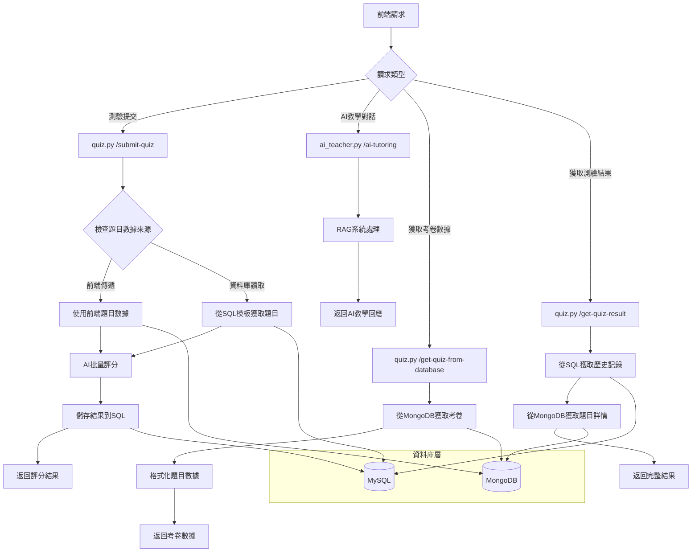
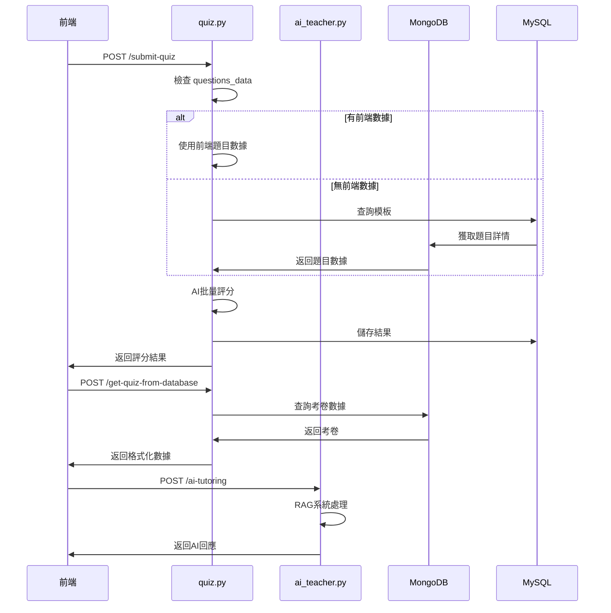

# 合併衝突解決流程圖

## 系統架構流程

## 主要修改內容

### 1. quiz.py 新增功能
- ✅ 添加 `get_quiz_from_database()` 函數
- ✅ 添加 `/get-quiz-from-database` 端點
- ✅ 修復 `submit_quiz()` 中的 `questions_data` 變數未定義問題
- ✅ 添加必要的 import 語句

### 2. 功能整合
- ✅ 統一考卷數據獲取邏輯
- ✅ 保持向後兼容性
- ✅ 支持前端傳遞題目數據和資料庫讀取兩種模式

### 3. 錯誤處理
- ✅ 完善的異常處理機制
- ✅ 詳細的日誌記錄
- ✅ 用戶友好的錯誤訊息

## 數據流程

## 技術要點

1. **模組化設計**: 將考卷數據獲取邏輯封裝為獨立函數
2. **靈活性**: 支持多種數據來源（前端傳遞、資料庫讀取）
3. **可擴展性**: 易於添加新的考卷類型和評分方式
4. **錯誤恢復**: 完善的錯誤處理和日誌記錄
5. **性能優化**: 批量處理和緩存機制

## 測試建議

1. 測試前端傳遞題目數據的場景
2. 測試從資料庫讀取題目的場景
3. 測試AI評分的準確性
4. 測試錯誤處理機制
5. 測試性能表現
